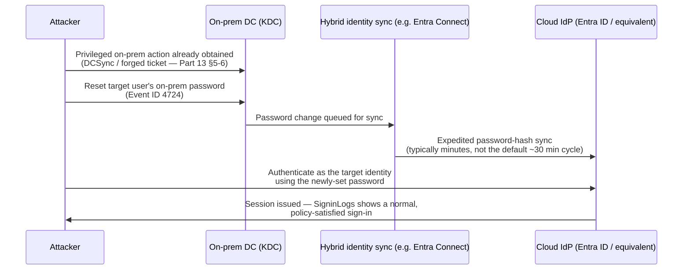
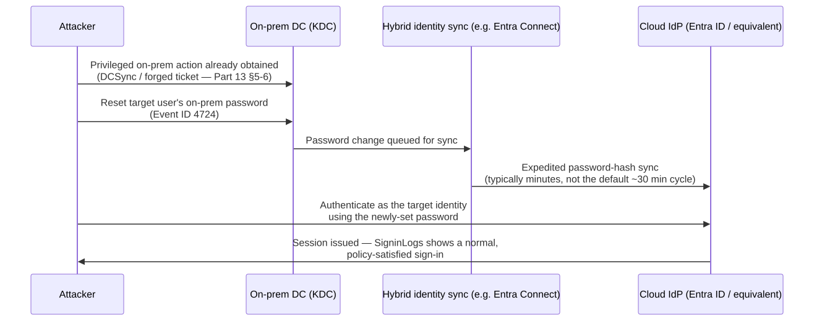
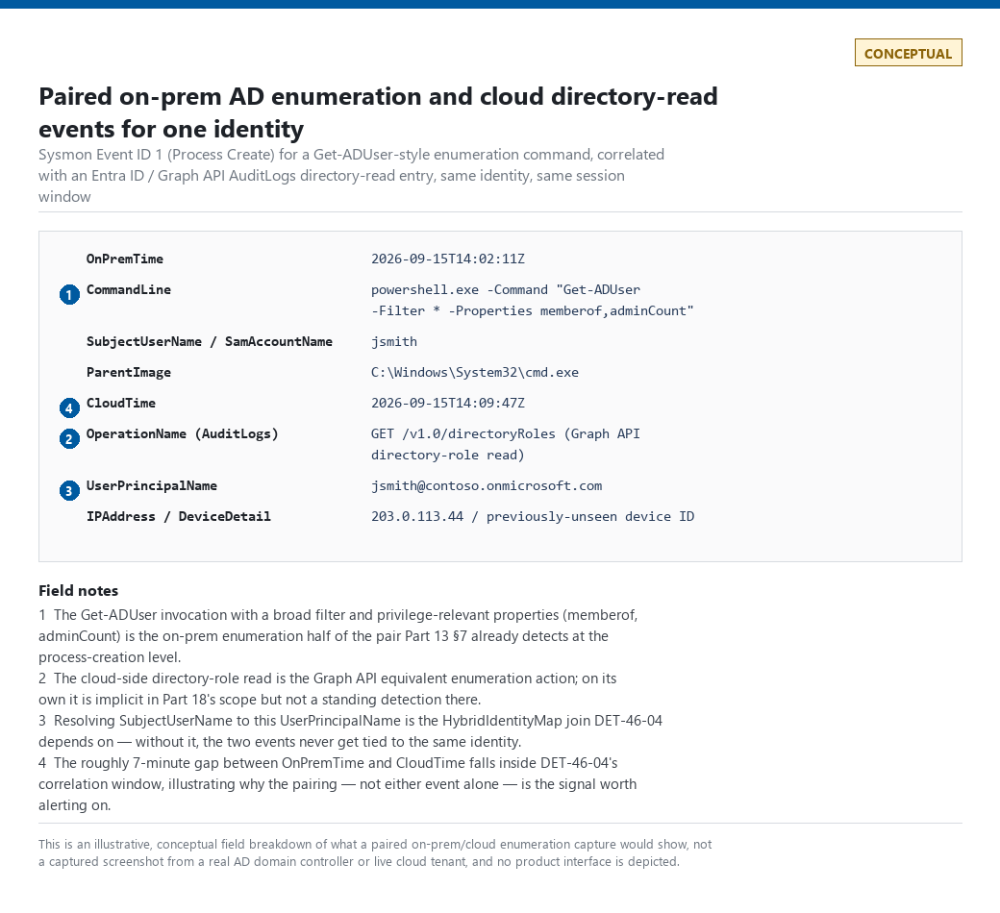
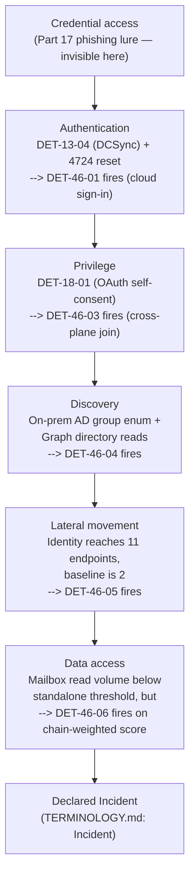

# Part 46 — Identity Compromise Model

## Why this part exists

**[CONCEPT]** Parts 12, 13, and 18 each own one telemetry lane of identity: Part 12 owns IdP/SSO sign-in logs, Part 13 owns Active Directory and Kerberos protocol telemetry, and Part 18 owns cloud-identity audit logs and OAuth consent trails. Each of those parts is deliberately narrow — it says so explicitly in its own scope section — because the telemetry, the protocols, and the primary reader genuinely differ across the three. None of them builds the thing a real intrusion actually needs: a model of how a compromise moves *through* all three lanes as one continuous identity, from the moment a credential is first obtained to the moment data actually leaves. This part is that model. It does not re-derive a single detection query that Parts 12, 13, or 18 already own — every detection in those three parts is cross-referenced here by ID, not rewritten. What this part adds is the seam logic: the seven joins across telemetry lanes that no single source part can write, because each source part's author reasonably assumed the reader was already looking at their table.

The model has six stages: **credential access → authentication → privilege → discovery → lateral movement → data access.** This maps loosely, not identically, onto ATT&CK's tactic list — Credential Access (TA0006), Privilege Escalation (TA0004), Discovery (TA0007), Lateral Movement (TA0008), and Collection (TA0009) each line up cleanly with one stage; "authentication" does not have a single clean tactic equivalent, because a valid-account authentication event can serve Initial Access (TA0001), Persistence (TA0003), Privilege Escalation, or Defense Evasion (TA0005) depending on context — a nuance this part states honestly rather than forcing a false one-to-one mapping.

Two scoping notes worth stating up front. First, this part is not Part 44 — Part 44 is the general-purpose ATT&CK-stage bridge across every domain in the book (Parts 8–21); this part is the identity-specific instance of that same idea, built only from Parts 12/13/18, and goes deeper on the identity seam than Part 44's breadth-first treatment can. Second, the author's home lab has no Active Directory domain controller and no live cloud tenant with a screenshot-capture pipeline — the same gap Part 13 and Part 18 already name in their own `[FIGURE PENDING]` blocks. Where this part needs a Kerberos or cloud-audit-log capture, it says so plainly rather than fabricating one. Where real evidence *does* exist and is on-topic — genuine SSH authentication and sudo-invocation telemetry from the author's home-lab containers — this part uses it, because Linux privilege-elevation telemetry is a real identity-adjacent surface that Parts 12, 13, and 18 never touch (all three are Windows-directory- and cloud-IdP-scoped) and Part 3 only surveys at the telemetry-fidelity level, not the analytic level.

---

## 1. Scope: the model, the seam, and what this part does not re-derive

**[CONCEPT]** The table below is the spine of this part: which stage, which telemetry lane, which part already owns the standing detections for it, and what this part adds on top.

| Stage | Primary telemetry lane(s) | Owning part(s) for standing detections | What Part 46 adds |
|---|---|---|---|
| Credential access | Endpoint (LSASS/SAM), email, leaked-credential intel | Part 11, Part 17, Part 32 | Names the stage as the identity model's own blind spot — see §2 |
| Authentication | IdP sign-in logs; Kerberos AS/TGS | Part 12, Part 13 | Cross-plane correlation joining an on-prem privileged action to a cloud sign-in for the same synced identity — DET-46-01 |
| Privilege | AD group membership, DCSync; cloud role assignment, OAuth consent; **Linux sudo (uncovered elsewhere)** | Part 13, Part 18; **this part** | DET-46-02 (Linux sudo baseline), DET-46-03 (on-prem-to-cloud privilege pivot) |
| Discovery | LDAP enumeration; cloud directory/Graph enumeration | Part 13 §7, Part 18 (implicitly) | Cross-surface discovery-burst correlation — DET-46-04 |
| Lateral movement | Pass-the-Hash/Pass-the-Ticket; guest/cross-tenant pivoting | Part 13 §5, Part 18 §3 | Identity fan-out across systems as a single generalized signal — DET-46-05 |
| Data access | Mail/file access via OAuth scope; on-prem file/share access | Part 18 §2; Part 11 (endpoint side) | Chain-weighted alerting that lowers the trigger threshold using accumulated stage risk — DET-46-06 |

Every technique named in this table is covered at the query level in its owning part. This part cites those detection IDs by name (`DET-12-03`, `DET-13-04`, `DET-18-01`, and so on) rather than reprinting their logic — if a reader needs the actual query, the cross-reference points to it.

> **Engineering Reality**
> The single biggest practical obstacle to everything in this part is entity resolution across telemetry lanes (see TERMINOLOGY.md § Entity Key / Entity Resolution) — joining a Windows Security-log `TargetUserName` or `SubjectUserSid` to an Entra ID `UserPrincipalName` to the same human requires a maintained hybrid-identity mapping table that most organizations do not have as a first-class, owned artifact. Every cross-plane detection in this part (DET-46-01, DET-46-03, DET-46-04) depends on that mapping existing and staying current; a stale or partial mapping table doesn't error, it just silently drops rows from the join, which reads as "no cross-plane activity found" rather than "the join couldn't run."

> **Blind Spot**
> Every correlation this part defines is a bounded time join — DET-46-01's 30-minute reset window, DET-46-03's and DET-46-04's 2-hour pivot windows, DET-46-05's 2-hour fan-out window — and a bounded time join has one exploitable edge regardless of how the rest of its logic is written: an attacker who simply waits longer than the window defeats it. Resetting a password on-prem, then waiting six hours before signing in to the cloud identity, produces the same two events DET-46-01 is built to catch, joined by nothing, because the join condition expired before the second event arrived. Widening a window trades this blind spot for alert volume and staleness in the other direction — no window size closes it, it only moves the tradeoff.

---

## 2. Stage 1 — Credential access: the identity model's own blind spot

**[CONCEPT]** Credential access — a phished OAuth consent grant, LSASS memory scraping, a stolen infostealer log, a crackable Kerberoastable service-account password — is the stage where a credential actually changes hands, and it is the stage identity telemetry itself is worst positioned to see, because identity telemetry starts recording at the *use* of a credential, not its *theft*. Part 11 owns memory-resident credential theft; Part 17 owns the phishing delivery mechanism for consent-grant and password-harvesting lures; Part 32 owns leaked-credential and infostealer-log threat intelligence; Part 13 §3.2 (`HUNT-13-01`) owns the proactive audit for Kerberoastable weak passwords before they're ever cracked. None of that logic is repeated here.

> **Blind Spot**
> A stolen, valid credential used correctly on its first attempt produces zero identity-telemetry anomaly at the point of theft and often none at the point of first use either — Part 12 names this exact gap for its own detections (§4's Blind Spot box on DET-12-03), and it is the same gap here, just stated at the model level: **every detection in this part assumes the compromise has already progressed to at least the authentication stage.** A credential stolen and never yet used is invisible to this entire model by construction; it is only visible, if at all, to the threat-intel and endpoint telemetry Parts 11, 17, and 32 own.

---

## 3. Stage 2 — Authentication: the seam between Part 12 and Part 13

**[CONCEPT]** A hybrid identity — a human account that exists simultaneously as an on-prem Active Directory object and a synced Entra ID (or equivalent) cloud identity — authenticates twice, through two structurally different protocols, logged to two structurally different tables, owned in most organizations by two different teams. Part 13 owns the on-prem Kerberos AS/TGS exchange (Event IDs 4768, 4769, 4771). Part 12 owns the cloud sign-in log. Neither part's own detections join the two, because neither part's author can assume the reader has the other table open — that join is this part's job.

The concrete mechanism worth naming: an attacker who has already gained an on-prem privileged path — via DCSync (`DET-13-04`'s territory), a forged ticket, or any other Part 13-covered technique — can use that privilege to reset a target user's on-prem password (Event ID 4724, "An attempt was made to reset an account's password"). If password hash synchronization is enabled for that identity, Microsoft's own hybrid-identity documentation describes password changes as propagating to the cloud identity on an expedited cycle, typically completing within minutes — much faster than the default directory-object sync cycle, which runs on a roughly 30-minute interval as of this writing. The attacker now holds a working cloud credential for the same identity, and the cloud sign-in that follows looks, on its own, exactly like the account owner logging in normally: no failure burst, no impossible travel, nothing DET-12-01 through DET-12-05 is built to catch, because none of those detections assume the "legitimate" credential in front of them was handed to the attacker by a privileged on-prem action minutes earlier.






**Figure 46.1 (FIG-46-01) — On-prem privileged reset to cloud sign-in, the hybrid-identity pivot.** *CONCEPTUAL.* Illustrates the sequence by which an on-prem privileged action converts into standing cloud access for the same synced identity, without either plane's own standing detections seeing the combination as anomalous. This is a sketch of the documented hybrid-identity risk mechanism, not a capture from a real intrusion — no domain controller exists in the author's lab to generate the paired 4724/`SigninLogs` events this figure describes.

**[DETECTION ENGINEER]**

### 3.1 DET-46-01 — On-prem privileged password reset followed by cloud sign-in for the same identity

The following illustrative Microsoft Sentinel KQL query joins `SecurityEvent` (on-prem Windows Security events, ingested via the standard AMA/legacy agent connector) against `SigninLogs` (Entra ID). It depends on a maintained `HybridIdentityMap` table resolving `TargetSid`/`TargetUserName` to `UserPrincipalName` — see the Engineering Reality box in §1 for why that table is the load-bearing, easy-to-neglect piece.

CONCEPTUAL SAMPLE — illustrative Sentinel KQL, untested against a real hybrid-identity environment (see the Figure 46.1 caption above for the lab constraint).

```kql
// DET-46-01: on-prem privileged password reset (4724), not self-initiated,
// followed by a cloud sign-in for the same identity within the sync-lag window.
let ResetWindow = 30m;   // generous margin over the expedited sync cycle described in §3
let Resets =
    SecurityEvent
    | where EventID == 4724
    | where SubjectUserSid != TargetSid          // defensive filter: a genuine 4724 is a
                                                  // reset performed on someone else's behalf,
                                                  // not the account holder changing their own
                                                  // password (that logs as 4723, not 4724) —
                                                  // this guards against a malformed/replayed
                                                  // event rather than a real self-service case
    | join kind=inner HybridIdentityMap on TargetSid
    | project ResetTime = TimeGenerated, TargetUserName, UserPrincipalName, SubjectUserName, SubjectUserSid;
SigninLogs
| where ResultType == "0"
| join kind=inner Resets on UserPrincipalName
| where TimeGenerated between (ResetTime .. ResetTime + ResetWindow)
| project ResetTime, SignInTime = TimeGenerated, UserPrincipalName, SubjectUserName, IPAddress, DeviceDetail
```

**MITRE:** T1098 (Account Manipulation), T1078.002 (Valid Accounts: Domain Accounts), T1078.004 (Valid Accounts: Cloud Accounts).

> **False Positive Trap**
> A legitimate IT help-desk password reset — after a real user forgets a password, or as routine post-incident credential rotation *for an unrelated, already-resolved issue* — produces the identical two-event pattern: an admin-initiated 4724, followed by the user's own next cloud sign-in. The distinguishing context this query cannot see on its own is whether the reset itself was requested through a legitimate, ticketed channel. Join against your help-desk/ITSM system's reset-ticket log before escalating, the same approved-change-window pattern `DET-13-05` uses for privileged-group changes — treat "no matching ticket" as the anomaly, not the reset event itself.

> **Blind Spot**
> This detection's entire mechanism depends on password hash synchronization actually being the identity's cloud authentication path. An identity using federated authentication (ADFS or equivalent) or pass-through authentication never generates the expedited hash-sync event this query waits for — the on-prem reset has no cloud-side echo to join against, and DET-46-01 produces zero alerts for that population no matter how the identity is compromised. Separately, an attacker who already holds DCSync rights doesn't need to touch the password at all: the sync hash Entra ID stores is a deterministic function of the on-prem NTLM hash and the account SID, a mechanism independent security researchers have reverse-engineered and published, so a DCSync'd hash converts directly into a working cloud credential with no Event ID 4724 ever generated. Both paths reach a working cloud session for the target identity while producing none of the telemetry this query correlates on.

> **Detection Test**
> **Setup:** A synthetic `SecurityEvent` row shaped like a real 4724 (`SubjectUserSid != TargetSid`) mapped through a test `HybridIdentityMap` entry, paired with a synthetic `SigninLogs` row (`ResultType == "0"`) for the same mapped `UserPrincipalName`.
> **Action:** Emit the 4724 event, then the sign-in event roughly 6 minutes later — inside the 30-minute `ResetWindow`.
> **Expected result:** One joined row with `ResetTime` and `SignInTime` about 6 minutes apart. Re-run with the sign-in moved to 40 minutes after the reset — the row should disappear, confirming the window boundary is actually enforced and not just the join key.

> **Detection Autopsy — "on-prem and cloud identity alerts are two separate queues"**
>
> **The rule:** No rule at all — the default operating pattern in most organizations, where the AD/on-prem security team monitors Part 13-style detections and a separate cloud/IAM team monitors Part 12/18-style detections, with no standing correlation between the two queues.
>
> **Why it shipped:** The two domains genuinely have different telemetry, different owning teams, and different tooling — Part 13's own scope section says so explicitly, and reasonably. Building a cross-plane correlation looks like extra infrastructure for a comparatively rare attack path, easy to defer.
>
> **How it failed:** An attacker who pivots exactly the way §3 describes generates one alert-worthy event in each queue — a 4724 in the AD queue, a routine-looking sign-in in the cloud queue — and neither team's analyst has the other event in view. Each event, triaged alone, disposes as benign or low-priority; the chain that would make either one urgent never gets assembled, because assembling it requires a join neither queue's owner was ever asked to build.
>
> **The fix:** DET-46-01's join, owned explicitly by whichever team is accountable for the hybrid-identity seam — which, per §11 below, is itself usually the missing piece, not the query.

---

## 4. Stage 3 — Privilege: AD groups, cloud roles, and the Linux layer neither covers

**[CONCEPT]** Part 13 covers Windows/AD privilege escalation in depth: privileged-group membership (`DET-13-05`), DCSync (`DET-13-04`), Kerberoasting and AS-REP Roasting. Part 18 covers the cloud equivalent: OAuth consent as a privilege grant (`DET-18-01`), guest/role assignment (`DET-18-02`). Neither part — nor any other part in this book — builds analytic-layer detection for Linux `sudo` invocation as an identity-and-privilege chain stage; Part 3 surveys Linux/auditd/SSH telemetry at the fidelity level only. That gap is real, and it matters: a Linux host with a compromised low-privilege account is a legitimate stage-3 pivot point in exactly the same conceptual sense as an AD privileged-group addition, just on a third telemetry lane this book hadn't yet covered analytically.

### 4.1 DET-46-02 — Anomalous sudo invocation relative to per-account baseline shape

**[DETECTION ENGINEER]** Real sudo-invocation telemetry from two of the author's home-lab containers shows what a *baseline* for this stage actually looks like — and the two baselines are visibly different shapes, which is the whole point: a scripted service account and a human administrator use sudo in recognizably different patterns, and the anomaly worth alerting on is an account crossing from one shape into the other, not any single sudo invocation in isolation.

```text
Jun 17 09:40:23 pihole sudo[4161]:     root : TTY=pts/1 ; PWD=/root ; USER=pihole ; COMMAND=/usr/bin/bash /opt/pihole/gravity.sh --force
Jul 07 11:54:58 pihole sudo[33546]:     root : TTY=pts/1 ; PWD=/root ; USER=root ; COMMAND=/usr/bin/ss -tulpn
Jul 13 14:22:20 pihole sudo[51654]:     root : TTY=pts/1 ; PWD=/root ; USER=root ; COMMAND=/usr/bin/ss -tulpn
Aug 17 15:28:38 pihole sudo[143836]:     root : TTY=pts/1 ; PWD=/root ; USER=root ; COMMAND=/usr/bin/pihole-FTL --config
```

**Figure 46.2 (FIG-46-02) — Interactive, human-driven sudo invocations.** *REAL LAB EXAMPLE.* Captured via `grep -i sudo /var/log/auth.log` on CT100 ("pihole"), a real LXC container on the author's home Proxmox lab. Every entry carries a real `TTY` (a human at a terminal), spans roughly two months between invocations, and runs a different command each time — the shape of a system administrator doing occasional, varied maintenance. Captured 2026-09-15; log lines themselves span 2026-06-17 through 2026-08-17.

```text
Sep 10 05:42:02 vulnscan sudo[2229]:     root : PWD=/root ; USER=vulnscan ; COMMAND=/usr/bin/sqlite3 /opt/vulnscan/data/vulnscan.db 'SELECT count(*) FROM scanner_errors;'
Sep 10 06:38:57 vulnscan sudo[2393]:     root : PWD=/root ; USER=vulnscan ; COMMAND=/usr/bin/sqlite3 /opt/vulnscan/data/vulnscan.db 'SELECT count(*) FROM scanner_errors;'
Sep 10 07:35:56 vulnscan sudo[2616]:     root : PWD=/root ; USER=vulnscan ; COMMAND=/usr/bin/sqlite3 /opt/vulnscan/data/vulnscan.db 'SELECT count(*) FROM scanner_errors;'
Sep 10 07:53:34 vulnscan sudo[2667]:     root : PWD=/root ; USER=vulnscan ; COMMAND=/usr/bin/sqlite3 /opt/vulnscan/data/vulnscan.db 'SELECT key,value FROM config WHERE key IN (\'intel_version\',\'intel_last_success_at\');'
```

**Figure 46.3 (FIG-46-03) — Scripted, service-account sudo invocations.** *REAL LAB EXAMPLE.* Captured via `journalctl _COMM=sudo` on CT104 ("vulnscan"), the vulnerability-scanner platform's own real host. Note the absence of a `TTY` field (no interactive terminal — a cron-driven or systemd-timer-driven script), the near-identical command run roughly every 40–60 minutes, and the single target account (`vulnscan`) — the shape of a health-check job polling its own database, not a human. Captured 2026-09-15; log lines span 2026-09-10.

The two figures above are the actual baseline inputs DET-46-02 scores against — real evidence, not an invented threshold. The anomaly this detection targets is neither figure's pattern in isolation; it's a `vulnscan`-shaped account suddenly acquiring a `pihole`-shaped invocation (a new `TTY`, a never-before-seen command, an interactive session opened outside the account's normal cadence) or vice versa. The baseline itself (`sudo_account_baseline.csv` below) is a per-account rolling model in the same sense Part 31 defines — built from historical observation over a stated window with a decay/refresh policy, not a hand-picked constant — and this detection inherits Part 31's baselining mechanics rather than re-deriving them.

> **Engineering Reality**
> Raw sudo syslog/journald output is not one line per invocation — Figures 46.2 and 46.3's own source files show each real invocation producing three to four lines: the audit line carrying `TTY`/`COMMAND`, plus separate `pam_limits` and `pam_unix` session-open/session-close lines that carry neither field. A query that runs `stats` over every line matching `sourcetype=sudo` without first isolating the audit line double- or quadruple-counts `invocation_count` and, worse, corrupts `interactive_ratio` — the session-open/close lines have no `tty` field at all, so they always evaluate `is_interactive=0` and silently drag a genuinely interactive account's ratio toward zero. The query below filters to the audit line explicitly before aggregating; a rule that skips this filtering step will look plausible and score wrong.

CONCEPTUAL SAMPLE — illustrative Splunk SPL, generalized from the real per-account shapes shown in Figures 46.2–46.3; not a tuned production rule.

```spl
index=linux_auth sourcetype=sudo
| where isnotnull(command) AND command!=""   // isolate the audit line — see Engineering
                                              // Reality above; pam_limits/pam_unix session
                                              // lines carry no command field and must not
                                              // be counted as invocations
| eval is_interactive=if(isnotnull(tty) AND tty!="", 1, 0)
| stats count as invocation_count,
        dc(command) as distinct_commands,
        values(command) as commands_today,
        values(tty) as tty_values,
        avg(is_interactive) as interactive_ratio
      by target_user, span=1d
| lookup sudo_account_baseline.csv target_user OUTPUT expected_interactive_ratio, expected_daily_count, known_commands
| eval ratio_delta=abs(interactive_ratio - expected_interactive_ratio)
| eval known_commands_mv=split(known_commands, ";")
| eval unseen_commands=mvmap(commands_today, if(mvfind(known_commands_mv, commands_today) >= 0, null(), commands_today))
| eval unseen_command_count=mvcount(unseen_commands)
| where ratio_delta > 0.5 OR invocation_count > (expected_daily_count * 3) OR unseen_command_count > 0
```

This query depends on `command`, `tty`, and `target_user` all being correctly extracted by the sourcetype's field extraction — if the extraction misparses `USER=` (the sudo target) versus the leading username (the invoking principal — `root` in every log line captured for Figures 46.2–46.3, though sudo's log format does not guarantee that generally: the leading name is whoever ran the `sudo` command, not necessarily `root`), `target_user` silently resolves to the wrong account and the baseline lookup joins against the wrong row rather than erroring. The main false-positive driver on the count-based clause: for a genuinely low-frequency human account (Figure 46.2's `pihole` baseline is roughly one invocation every two to four weeks), `expected_daily_count` rounds to a small fraction, so `invocation_count > expected_daily_count * 3` triggers on almost any single invocation day — the `ratio_delta` clause, not the count clause, is doing the real discriminating work for sparse-use accounts, and a program relying on this rule should expect the count-based branch to fire often and cheaply on accounts like that. The `unseen_command_count` clause is what actually gives the Detection Test box's claim about `distinct_commands` any teeth: the original count/ratio-only logic computed `distinct_commands` but never used it in the `where` clause, so a scripted account running one never-before-seen command inside its normal invocation volume and without ever opening a TTY passed through undetected. Comparing today's command set against a per-account allowlist (`known_commands`, maintained in the same baseline table) closes that gap for commands genuinely new to the account — it does not close it for an attacker who limits themselves to commands already in the account's own history (see the Blind Spot below).

**MITRE:** T1548.003 (Abuse Elevation Control Mechanism: Sudo and Sudo Caching), T1078.003 (Valid Accounts: Local Accounts).

> **Blind Spot**
> Two failure modes bound this detection, one from each direction. An attacker who reconnoiters the target account's history first and then only ever runs commands already present in `known_commands`, at a volume inside three times the account's own baseline, is invisible to this detection by construction — nothing here scores command intent, only novelty and rate. A newly provisioned account has the mirror-image problem: with no row yet in `sudo_account_baseline.csv`, the lookup returns no match, `ratio_delta` and `expected_daily_count` evaluate to empty, and every comparison against an empty value is false — the account never alerts no matter how much or how interactively it invokes sudo, until a baseline has had time to accumulate.

> **False Positive Trap**
> A legitimate one-off manual intervention on a normally scripted service account — an administrator interactively debugging why the `vulnscan` health check started failing, by `sudo -u vulnscan` running an ad hoc command from their own terminal session — produces exactly the "scripted account suddenly looks interactive" pattern this detection targets, for an entirely benign reason. The fix is the same one Part 13's privileged-group detection uses: correlate against a documented, ticketed maintenance window before escalating, rather than trying to characterize every legitimate manual-intervention shape well enough to exclude it in the query itself.

> **Detection Test**
> **Setup:** A lab Linux host with a scripted service account holding a narrow, logged sudo rule (mirroring CT104's `vulnscan` pattern above) and no `NOPASSWD` interactive shell access configured for that account.
> **Action:** From an interactive terminal, run `sudo -u <service-account> /bin/bash` to open an interactive shell as the service account.
> **Expected result:** A sudo log entry for the service account carrying a non-empty `TTY` field and a `COMMAND` value (`/bin/bash`) never seen in that account's baseline — the two signals DET-46-02's `interactive_ratio` and `distinct_commands` fields are built to catch.

### 4.2 DET-46-03 — On-prem privilege success correlated with a subsequent cloud privilege grant

**[DETECTION ENGINEER]** The same seam named in §3 recurs one stage later: an attacker who successfully Kerberoasts or DCSyncs an account (`DET-13-01`, `DET-13-04`) and rides that into a synced identity's cloud session (DET-46-01) frequently doesn't stop at authentication — the next move is acquiring a *cloud* privilege, either by granting a malicious OAuth app broad delegated scope from within that session (`DET-18-01`'s territory) or by assigning the compromised identity a privileged directory role (`DET-18-02`'s territory). No standing rule in Part 13 or Part 18 joins "on-prem privilege event happened" to "cloud privilege event happened for the same identity shortly after," because each rule is written from inside its own telemetry lane.

The query below implements only the DCSync-side variant of that join — the input is Event ID 4662 (An operation was performed on an object) filtered to the two replication-rights GUIDs DET-13-04 uses. It does **not** implement the Kerberoasting-side variant (a `DET-13-01`-style 4769 requester fan-out joined to the same cloud event stream): that requires unioning a second `OnPremPrivilegeEvents` source built from DET-13-01's own fan-out logic, keyed the same way through `HybridIdentityMap`, which this part has not built out. Treat the Kerberoasting path as a documented extension, not a shipped detection — the MITRE line below is scoped to what the query actually evaluates.

CONCEPTUAL SAMPLE — illustrative Sentinel KQL; untested against a real hybrid environment.

```kql
// DET-46-03 (DCSync variant only): on-prem replication-rights success (4662)
// followed by a cloud consent grant or role assignment for the mapped identity.
// See the prose above for why the Kerberoasting/4769 variant is not implemented here.
let PivotWindow = 2h;
let OnPremPrivilegeEvents =
    SecurityEvent
    | where EventID == 4662 and (Properties has "1131f6aa-9c07-11d1-f79f-00c04fc2dcd2"
                               or Properties has "1131f6ad-9c07-11d1-f79f-00c04fc2dcd2")   // same GUIDs as DET-13-04
    | join kind=inner HybridIdentityMap on $left.SubjectUserSid == $right.TargetSid
    | project OnPremTime = TimeGenerated, UserPrincipalName, SubjectUserName;
AuditLogs
| where OperationName in ("Consent to application", "Add member to role", "Add eligible member to role")
| extend UserPrincipalName = tostring(InitiatedBy.user.userPrincipalName)
| join kind=inner OnPremPrivilegeEvents on UserPrincipalName
| where TimeGenerated between (OnPremTime .. OnPremTime + PivotWindow)
| project OnPremTime, CloudEventTime = TimeGenerated, UserPrincipalName, OperationName, SubjectUserName
```

**MITRE:** T1003.006 (OS Credential Dumping: DCSync), T1528 (Steal Application Access Token), T1098 (Account Manipulation). T1558.003 (Kerberoasting) does not apply to the query as written — see the scoping note above; it would apply once the fan-out variant is built.

> **Blind Spot**
> This detection only fires when the *same* identity is used on both sides of the pivot. An attacker who DCSyncs the domain, extracts the Entra Connect sync account's own on-prem credential material, and uses knowledge gained from directory replication to target a *different*, unrelated cloud identity entirely bypasses this join — nothing ties the two events together on the identity key this query relies on. Catching that variant needs the broader dwell-time hunt in §9, not a standing correlation rule.

> **False Positive Trap**
> The Entra Connect (or equivalent) sync account itself exercises the same replication-rights GUIDs this query keys on as its normal, continuous function — it must be excluded from `OnPremPrivilegeEvents`, the same exclusion `DET-13-04` itself requires, or every sync cycle becomes a candidate match paired with whatever unrelated cloud consent/role event happens to land in the following two hours. Separately, a legitimate new-admin onboarding — a help-desk or identity-ops account performing a routine, ticketed directory action and being granted a cloud role the same day for the actual onboarding task — produces the identical shape for an entirely benign reason. Resolve both with the same ticketed-change-window join `DET-46-01`'s False Positive Trap describes; this query has no way to distinguish the two on its own.

> **Detection Test**
> **Setup:** A synthetic `SecurityEvent` 4662 row carrying one of the two replication-rights GUIDs, mapped through `HybridIdentityMap` to a test `UserPrincipalName`, paired with a synthetic `AuditLogs` row for that identity with `OperationName == "Consent to application"`.
> **Action:** Emit the 4662 event, then the `AuditLogs` consent event 90 minutes later — inside the 2-hour `PivotWindow`.
> **Expected result:** One joined row. Move the `AuditLogs` event to 3 hours after the 4662 event and re-run — the row should disappear, confirming the join is time-bounded rather than an unconditional identity match.

---

## 5. Stage 4 — Discovery: LDAP, Graph, and the identity that touches both

**[CONCEPT]** Part 13 §7 covers LDAP enumeration on-prem — mostly detected at the process/command-line level (`Get-ADUser`, `dsquery`) rather than the LDAP protocol itself, per that section's own stated limitation. Cloud-side discovery — enumerating app registrations, directory roles, or Graph API objects — is implicit in Part 18's scope but not built out as its own standing detection there. The identity-model addition here is narrow but real: an identity that performs on-prem directory enumeration *and* cloud directory/Graph enumeration within a short window is a stronger discovery signal than either alone, because a legitimate human rarely needs both in the same session — most job functions live entirely in one plane or the other.

**[DETECTION ENGINEER]**

### 5.1 DET-46-04 — Cross-surface discovery burst

CONCEPTUAL SAMPLE — invented generic schema joining an on-prem process-creation signal (Part 11's territory for the command-line detection itself) to a cloud directory-read signal; illustrates the join shape, not a specific vendor's exact field names.

```text
// Illustrative join logic, not tied to one platform's query language.
// "on_prem_enum_events" is the process-creation-based LDAP enumeration signal
// Part 13 §7 and Part 11 already build; "cloud_directory_reads" is a Graph API
// / AuditLogs-derived directory-read event stream. Aggregated with a minimum
// enumerated-object count on each side — a bare single-occurrence join fires
// on one routine on-prem lookup paired with one routine cloud read, which is
// exactly what a helpdesk onboarding ticket looks like (see the False
// Positive Trap below); the thresholds here are illustrative starting points,
// not tuned values.
SELECT a.identity,
       MIN(a.event_time) AS onprem_time,
       MIN(b.event_time) AS cloud_time,
       COUNT(DISTINCT a.object_enumerated) AS onprem_objects_touched,
       COUNT(DISTINCT b.graph_endpoint) AS cloud_endpoints_touched
FROM on_prem_enum_events a
JOIN cloud_directory_reads b
  ON a.identity = b.identity
 AND b.event_time BETWEEN a.event_time AND a.event_time + INTERVAL '2 hours'
GROUP BY a.identity
HAVING COUNT(DISTINCT a.object_enumerated) >= 5
   AND COUNT(DISTINCT b.graph_endpoint) >= 3
```

**MITRE:** T1087.002 (Account Discovery: Domain Account), T1087.004 (Account Discovery: Cloud Account), T1069.002 (Permission Groups Discovery: Domain Groups).

> **False Positive Trap**
> Identity and helpdesk administrators — the accounts provisioning a new hire's AD object, then assigning that same hire's cloud license and role in the same onboarding session — legitimately touch both planes together as their actual job, every working day. The single-occurrence join this query started from would fire on every routine onboarding ticket; even with the count thresholds added above, a busy identity-operations team doing bulk onboarding in one sitting can still cross both. Exclude known identity-admin and helpdesk service/human accounts by role, and treat a hit from an excluded account as a signal the exclusion list needs review, not as a false positive to silently suppress.

> **Blind Spot**
> Beyond the window-evasion bypass §1 already names for this detection's 2-hour pivot window, the count thresholds are a second, independent bypass surface: an attacker who enumerates fewer than 5 distinct on-prem objects and fewer than 3 distinct Graph endpoints inside the window — deliberately narrow, targeted reconnaissance rather than a broad sweep — never crosses either `HAVING` clause and produces no alert, no matter how suspicious the pairing would look to a human reviewing the raw events directly. Lowering the thresholds trades this gap for the onboarding false positives described above; no single threshold setting closes both problems at once.

> **Detection Test**
> **Setup:** Synthetic `on_prem_enum_events` rows for one test identity touching 6 distinct `object_enumerated` values, and synthetic `cloud_directory_reads` rows for the same identity touching 4 distinct `graph_endpoint` values, all timestamped within the same 2-hour span.
> **Action:** Run the join/aggregation query above against the synthetic data.
> **Expected result:** One row for the test identity with `onprem_objects_touched = 6` and `cloud_endpoints_touched = 4`, both above their `HAVING` thresholds. Reduce either side below its threshold (e.g., to 3 objects) and re-run — the row should disappear, confirming the thresholds are load-bearing rather than accidentally satisfied by the join itself.

> **Hunter's Note**
> Don't wait for this correlation to fire before pulling the full picture. If you're already looking at a confirmed on-prem enumeration event for an identity, pull that identity's Graph API sign-in activity for the same day *regardless of volume* — a single, unremarkable-looking directory read that lands right after an on-prem enumeration burst is exactly the kind of thing a threshold-based rule like DET-46-04 is tuned to ignore until it happens a second or third time, and by then the attacker already has what they came for.



**Figure 46.3a (FIG-46-04) — Paired on-prem AD enumeration and cloud directory-read events for one identity.** *CONCEPTUAL — illustrative field breakdown; not a captured screenshot.* Illustrates the field-level shape a real `Get-ADUser`-style enumeration command's process-creation event and a Graph API directory-read audit-log entry would carry for the same identity within the same session — see "Why this part exists" for the lab constraint behind every conceptual figure in this part. Supports DET-46-04's join logic with an illustrative field-layout reference.

---

## 6. Stage 5 — Lateral movement: one identity's authority, reused everywhere it can reach

**[CONCEPT]** Part 13 §5 covers Pass-the-Hash and Pass-the-Ticket as on-prem, protocol-specific lateral movement. Part 18 §3 covers cross-tenant and guest pivoting as the cloud-plane equivalent — access reached through a trust relationship rather than a stolen ticket. Neither part states the generalization: **lateral movement, at the identity-model level, is one identity's authority reaching a materially larger number of distinct systems, tenants, or applications in a short window than its own history supports** — regardless of whether the specific mechanism is a replayed Kerberos ticket, a guest role inherited through nested group membership, or a session token reused across API calls. The specific remote-service technique that carries the payload (SMB, RDP, WinRM — T1021 and its sub-techniques) is Part 14's territory and isn't re-derived here; this part's job is naming the identity-authority-fan-out shape as the thing worth alerting on, independent of which specific protocol carries it.

**[DETECTION ENGINEER]**

### 6.1 DET-46-05 — Identity fan-out across systems, tenants, or applications

This detection is deliberately generalized rather than tied to one telemetry source — it depends on Part 30's correlation mechanics and Part 31's baselining mechanics for the actual implementation, and is illustrative of the *shape* of the join, not a ready-to-run query against a named product.

CONCEPTUAL SAMPLE — illustrative Sentinel KQL against a hypothetical unioned identity-activity view; requires Part 30/31-style baseline infrastructure this part does not re-derive.

```kql
// DET-46-05: one identity touching a distance-from-baseline number of distinct
// systems/apps/tenants in a bounded window. IdentityActivityUnion is illustrative —
// a real implementation unions SecurityEvent logon targets, SigninLogs AppDisplayName,
// and AuditLogs resource targets, keyed through the same HybridIdentityMap as DET-46-01.
IdentityActivityUnion
| where TimeGenerated > ago(2h)
| summarize DistinctTargets = dcount(TargetSystem), Targets = make_set(TargetSystem, 20) by UserPrincipalName
| lookup identity_target_baseline.csv UserPrincipalName OUTPUT p95_distinct_targets_2h
| where DistinctTargets > (p95_distinct_targets_2h * 3)
```

**MITRE:** T1078 (Valid Accounts), T1550.002 (Pass the Hash), T1550.003 (Pass the Ticket), T1199 (Trusted Relationship).

> **Blind Spot**
> Two failure modes bound this detection. Cold start: an identity with no row yet in `identity_target_baseline.csv` — a newly provisioned account, exactly the kind of thing an attacker with directory-write access might create for persistence — has `p95_distinct_targets_2h` return empty from the lookup; any comparison against an empty value is false, so a brand-new account can fan out to any number of systems without ever crossing the threshold. Window evasion: the detection only sees fan-out inside its own 2-hour lookback. An identity that reaches the same eleven endpoints the worked example in §8 describes, at a rate of one every four hours instead of one every few minutes, never has more than one or two distinct targets in any single 2-hour window and never fires, even though the total reach is identical.

> **False Positive Trap**
> An IT administrator running a fleet-wide maintenance script, or a service account backing a newly deployed multi-host application tier, both legitimately reach a large number of distinct systems in a short window — the same shape this detection is built to catch. This is why the threshold above is relative to the *identity's own* 95th-percentile baseline rather than a fixed constant: an admin account whose baseline already includes fleet-wide reach won't trip this rule at three times its own normal, while a normally narrow-scoped human or service account will. A change-ticket join, the same pattern used throughout Parts 12/13/18, resolves the remaining ambiguity.

> **Detection Test**
> **Setup:** A row in `identity_target_baseline.csv` for a test `UserPrincipalName` with `p95_distinct_targets_2h = 2`, plus synthetic `IdentityActivityUnion` rows for that identity touching 7 distinct `TargetSystem` values inside a single 2-hour window.
> **Action:** Run the query above against the synthetic data.
> **Expected result:** The test identity appears in the output (`DistinctTargets = 7 > 2 * 3 = 6`). Re-run with only 5 distinct targets — below the `* 3` multiplier — and confirm the identity drops out, verifying the threshold arithmetic rather than just the presence of a `lookup` match.

---

## 7. Stage 6 — Data access: the objective, and why raw volume is the wrong trigger

**[CONCEPT]** Data access — reading mail via a granted OAuth scope (Part 18 §2's territory), pulling files from a share, querying a database — is usually the actual objective the first five stages existed to reach, and it's also the stage where the same raw signal (a large volume of file or mail reads) is completely unremarkable on any given Tuesday for a legitimate power user. Part 33 (Risk-Based Detection) already builds the general mechanism for combining weak signals into a score that crosses a threshold only in combination; this part's contribution is naming data access as the specific stage where that mechanism earns its keep for the identity model: a volume of mail/file access that would never trigger a standalone threshold becomes worth alerting on specifically *because* the same identity already accumulated risk from stages 2 through 5 within the same dwell window.

**[DETECTION ENGINEER]**

### 7.1 DET-46-06 — Chain-weighted data-access alert

CONCEPTUAL SAMPLE — illustrative scoring logic; the general risk-scoring mechanism is Part 33's, not re-derived here.

```text
// Illustrative composite-score logic, not a specific query language.
// StageScore accumulates points from any of DET-46-01/03/04/05 (or their
// Part 12/13/18 source detections) firing for the same identity within DwellWindow.
running_score = sum(
    stage_hit.weight
    for stage_hit in identity_stage_hits
    if stage_hit.identity == target_identity
    and stage_hit.time >= now() - DwellWindow
)

// A data-access volume alert that would need to cross HighThreshold alone
// only needs to cross a lower bar once running_score is already elevated —
// but that bar cannot be allowed to fall below NoiseFloor, the volume any
// account's routine background mail/file sync generates on an idle day.
effective_threshold = max(
    NoiseFloor,
    HighThreshold - (running_score * ThresholdReductionPerPoint)
)
alert = data_access_volume > effective_threshold
```

**MITRE:** T1114 (Email Collection), T1213 (Data from Information Repositories), T1530 (Data from Cloud Storage).

> **False Positive Trap**
> Without a floor, `effective_threshold` can fall to zero or below once `running_score` is high enough, and `data_access_volume > effective_threshold` then fires on routine background activity — a mail client's idle-sync poll, an automatic calendar refresh — that has nothing to do with the objective stage. `NoiseFloor` sets the lower bound under which no volume of ordinary background access should be treated as the trigger; set it from the same account's own idle-day baseline. Setting it too high just recreates the standalone-threshold problem this detection exists to avoid.

> **Blind Spot**
> This mechanism only lowers the bar in proportion to `running_score`, and `running_score` only accumulates from DET-46-01/03/04/05 (or their Part 12/13/18 source detections) actually firing. An attacker who successfully evades every earlier stage — including via the bypasses each of those detections' own Blind Spot boxes already document — reaches this stage with `running_score` at zero: `effective_threshold` never moves off `HighThreshold`, and this detection degrades silently into the standalone high-volume threshold Part 18 already runs, with no indication that the chain-weighting logic contributed nothing. Separately, nothing in `identity_stage_hits` caps or deduplicates repeated firings of a single noisy, low-fidelity stage detection for the same identity — several re-fires of one weak signal can lower `effective_threshold` as much as genuine progression through multiple distinct stages, turning one repeated false-positive-prone rule into an unearned discount on the last checkpoint.

> **Detection Test**
> **Setup:** A test identity with two synthetic `identity_stage_hits` entries inside `DwellWindow` (simulated DET-46-01 and DET-46-04 hits with their configured weights), plus a `data_access_volume` value set between `NoiseFloor` and the un-weighted `HighThreshold`.
> **Action:** Compute `running_score`, `effective_threshold`, and `alert` once with both stage hits present, and once with `identity_stage_hits` emptied for the same identity and the same `data_access_volume`.
> **Expected result:** With both stage hits present, `effective_threshold` drops below `data_access_volume` and `alert` evaluates true. With `identity_stage_hits` emptied, `effective_threshold` returns to `HighThreshold` and the same `data_access_volume` no longer alerts — confirming the chain-weighting, not a fixed threshold, is what fires.

> **SOC Management View**
> A data-access alert that only fired *because* of accumulated chain risk from earlier stages is, functionally, the last checkpoint before this stops being an alert and becomes a declared Incident (see TERMINOLOGY.md § Incident) — the SLA for triaging one of these should be measured in minutes, not the queue's normal rotation. If your program cannot distinguish "an ordinary high-volume data-access alert" from "a chain-weighted one that already has four other stage hits behind it" in the queue itself — if they render identically to the analyst picking up the ticket — that's a triage-tooling gap worth fixing before it's tested by a real incident.

---

## 8. Worked case study: reconstructing a full hybrid identity compromise chain

**[DETECTION ENGINEER]** The walkthrough below is an illustrative, constructed scenario — clearly not a real captured intrusion, since no AD lab or live tenant exists to generate one — built to show how the six stages and the DET-46 correlations above compose in practice. The privilege-stage detail is grounded in the real sudo baseline shapes captured in Figures 46.2–46.3; everything else is a plausible, illustrative sequence, not a claim about a real event.

**[ANALYST]** The same walkthrough read from the triage seat: each numbered step below is what an analyst picking up the resulting alert would actually need to pull to confirm the chain, not just the single fired detection in front of them.

A fictional identity, `jsmith`, exists as both an on-prem AD account and a synced Entra ID identity.

1. **Credential access (invisible to this model):** `jsmith`'s laptop is compromised via a phishing lure (Part 17's territory); an infostealer harvests a cached on-prem credential. No identity-lane telemetry records this step.
2. **Authentication:** The attacker uses the stolen credential to authenticate on-prem, then escalates via a DCSync attack (`DET-13-04` fires: a non-inventoried principal exercising replication rights) and forces a password reset on a separate, higher-value service account (Event ID 4724). `DET-46-01` fires roughly six minutes later when that service account's synced cloud identity signs in from a device it has never used before.
3. **Privilege:** From the cloud session, the attacker registers a malicious OAuth app and completes self-consent for `Mail.ReadWrite` and `Files.ReadWrite.All` (`DET-18-01` fires). `DET-46-03` fires independently, joining the earlier `4662` DCSync event to this consent grant for the same mapped identity — a stronger, chain-level signal than either alone.
4. **Discovery:** In the same session window, the attacker's tooling issues both an on-prem `Get-ADGroupMember` enumeration (matched by Part 13 §7's process-based logic) and a burst of Graph API directory-role reads. `DET-46-04` fires on the cross-surface pairing.
5. **Lateral movement:** The compromised service account's authority is used to reach eleven distinct application endpoints within twenty minutes — well outside its own 95th-percentile baseline of two. `DET-46-05` fires.
6. **Data access:** A subsequent burst of mailbox reads via the malicious app's granted scope would, alone, sit below the standing high-volume threshold Part 18 would otherwise require. Because `running_score` for this identity is already elevated from steps 2 through 5, `DET-46-06`'s reduced effective threshold triggers instead.






**Figure 46.4 (FIG-46-05) — Worked hybrid identity compromise chain, stage by stage.** *CONCEPTUAL.* Illustrates how the six stages and the DET-46 correlations compose across a single constructed scenario; the privilege-stage baseline shapes are grounded in the real sudo evidence in Figures 46.2–46.3, but the scenario as a whole is an illustrative walkthrough, not a captured real intrusion.

> **What Would Change My Mind**
> This case study assumes each stage's detection fires independently and the chain-weighting logic in `DET-46-06` combines them usefully. If a red-team exercise against a real hybrid environment showed that the entity-resolution join (§1's Engineering Reality box) fails often enough in practice — because the hybrid identity map lags real provisioning changes — that the chain-weighted score rarely reaches the identities it's supposed to, that would be a strong signal to invest first in entity-resolution reliability before any additional stage-specific detection logic in this part.

---

## 9. Threat hunting the identity compromise chain end-to-end

**[THREAT HUNTER]**

### 9.1 HUNT-46-01 — Full-chain dwell-time reconstruction from a single confirmed indicator

**Threat Hypothesis:** Given one confirmed indicator anywhere in the six-stage chain, earlier and later stage activity for the same identity exists in telemetry the standing DET-12/13/18/46 rules did not individually flag, because no single rule is built to see the whole chain — only this part's correlations are, and even those are threshold-gated.

Given any one fired alert from Parts 12, 13, 18, or this part, pull that identity's full activity across all three telemetry lanes — sign-in logs, Windows Security/Kerberos events, and cloud audit logs — for the entire suspected dwell window (Part 34's methodology, applied here specifically across the identity seam), not just the window the fired alert itself covers. The finding is whatever earlier or later-stage activity turns up that no rule caught at the time. Ends in either a documented negative finding (the chain really did start and stop where the fired alerts suggest) or new correlation candidates to add to this part's own DET-46 set.

**MITRE:** T1078 (Valid Accounts), T1003.006 (OS Credential Dumping: DCSync).

### 9.2 HUNT-46-02 — Hybrid-seam coverage audit

**Threat Hypothesis:** Identities that exist in both the on-prem directory and the cloud identity plane have asymmetric detection coverage — protected by Part 13's standing rules on-prem but not by Part 12/18's equivalents in the cloud, or the reverse — and that asymmetry is itself the exploitable gap, independent of any specific active compromise.

For every identity in the `HybridIdentityMap` (§1), check whether it is in scope for the relevant standing detections on *both* sides: does it appear in the population `DET-13-04`'s inventory table expects, and separately, does its cloud presence get evaluated by `DET-18-01`/`DET-18-02`'s logic? An identity — commonly a service account — that is exempted from on-prem monitoring as a "known noisy" account and also exempted from cloud monitoring as a "known service principal" for a different, uncoordinated reason is fully unmonitored on both planes at once, and neither owning team would know it without this specific cross-plane check.

**MITRE:** T1078.002 (Valid Accounts: Domain Accounts), T1078.004 (Valid Accounts: Cloud Accounts).

> **Blind Spot**
> This audit only checks identities that already have a row in `HybridIdentityMap`. An identity that should exist there but doesn't — a synced account the mapping table has never captured, or a shadow/orphaned service principal created outside the normal provisioning path — is invisible to this hunt by construction, and is very likely also the least-monitored identity in the environment on both planes at once, which is exactly the condition this hunt exists to find. Run the population check against directory-native identity lists (on-prem AD and Entra ID directly) rather than solely against `HybridIdentityMap`, and treat any identity present in one directory but absent from the map as a finding at least as urgent as an asymmetric-coverage hit.

### 9.3 HUNT-46-03 — Sudoers exposure audit, the Linux analog to HUNT-13-01

**Threat Hypothesis:** A meaningful fraction of accounts holding broad or `NOPASSWD` sudo rules on Linux hosts have never been reviewed against actual need, mirroring exactly the SPN-exposure argument Part 13's `HUNT-13-01` makes for Kerberoastable service accounts — and this book has, until this part, never built the Linux-specific version of that audit.

Pull the effective sudoers configuration (not the log — this hunt finds latent exposure, like `HUNT-13-02`) across every Linux host in scope, rank by breadth of grant (`ALL=(ALL) NOPASSWD: ALL` is the worst case) and by whether the granted account is a human or scripted service identity, and cross-reference against the real per-account baseline shapes this part establishes in Figures 46.2–46.3 — a scripted account with a broad, unscoped sudo grant is a materially higher-priority finding than a human admin with the same grant, since the scripted account's compromise path requires no social engineering at all.

**MITRE:** T1548.003 (Abuse Elevation Control Mechanism: Sudo and Sudo Caching).

> **Hunter's Note**
> Pull the sudoers grant scope before you pull anything else when a Linux host shows up in an identity-compromise chain. A `NOPASSWD` rule scoped to one specific script (like CT104's real `vulnscan` → `sqlite3` pattern in Figure 46.3) tells you the blast radius of that account's compromise is exactly that script's capability — nothing more. An unscoped `ALL=(ALL) NOPASSWD: ALL` grant on the same kind of service account means the moment that account is compromised, the attacker already has root, and every later stage in this part's model collapses into one step.

---

## 10. Analyst triage for a chain-composite alert

**[ANALYST]** A fired DET-46 alert is, by construction, already a composite of signals from at least two telemetry lanes — triage should start from that fact, not from treating it like a single-source alert.

1. Pull every DET-12/13/18 alert (fired or not — check the raw telemetry, not just the alert queue) for the same identity across the full dwell window the correlation covers, not just the two events the correlation joined.
2. Confirm the `HybridIdentityMap` entry the correlation used is actually current — a stale mapping can join the wrong human to the wrong service account, producing a chain-composite alert that's really two unrelated events wearing the same identity label.
3. For the privilege stage specifically, pull the account's own sudo/AD-group/OAuth-consent history and compare the flagged event against its own baseline shape (Figures 46.2–46.3 model what "normal" looks like for a Linux service account) — is this a genuine deviation, or a legitimate one-off maintenance action that a change ticket would explain?
4. If any stage in the chain resolves to a confirmed compromise, treat the *whole* identity — on-prem and cloud — as compromised for containment purposes, not just the plane where the confirming stage fired; a password reset on only one side leaves the other side's session or ticket material live.
5. Escalate to a declared Incident (TERMINOLOGY.md § Incident) once two or more stages resolve to true positive for the same identity — per §7's SOC Management View, a chain-weighted data-access alert is close enough to the objective stage that triage delay carries real cost.

---

## 11. Managing the identity compromise chain at the program level

**[SOC MANAGEMENT]**

> **SOC Management View**
> The single biggest organizational obstacle to everything in this part is that most organizations split ownership across exactly the seam this part is built to close: an on-prem AD/infrastructure team owns Part 13's telemetry, a cloud/IAM team owns Part 12 and Part 18's, and the SOC sits downstream of both, often without a mandate to require either team to maintain the `HybridIdentityMap` this part's every cross-plane detection depends on. Funding DET-46-01 through DET-46-06 without first assigning an explicit owner for that mapping table, and a documented SLA for keeping it current, produces detections that compile, run, and quietly return nothing — the exact "looks clean, isn't measured" failure mode named throughout Parts 12, 13, and 18. This is a staffing and ownership decision before it is a detection-engineering one.

---

## 12. What this part does not cover

Memory-resident credential theft mechanics (LSASS, SAM, DPAPI, infostealers) are Part 11's. Phishing delivery and OAuth-consent-grant lure mechanics are Part 17's. Leaked-credential and infostealer-log threat intelligence is Part 32's. The general-purpose, non-identity-specific ATT&CK-stage bridge across every telemetry domain in the book is Part 44's. The general risk-scoring mechanism DET-46-06 leans on is Part 33's. Network-protocol-level lateral movement (the specific SMB/RDP/WinRM mechanics that carry an identity's stolen authority from one host to the next) is Part 14's. This part owns, exclusively: the cross-plane correlations joining Parts 12, 13, and 18 into one six-stage identity model, and the Linux sudo-invocation analytic layer that no other part in this book builds.

---

## 13. Coverage summary

The table below maps each detection and hunt originated in this part to its MITRE ATT&CK technique and the stage it composes, for use in the program-level coverage matrix (Part 41). Detections and hunts from Parts 12, 13, and 18 that this part cross-references are not repeated here — see each part's own coverage summary.

| ID | Behavior | Stage | MITRE |
|---|---|---|---|
| `DET-46-01` | On-prem privileged password reset followed by cloud sign-in for the same synced identity | Authentication | T1098 (Account Manipulation), T1078.002 (Valid Accounts: Domain Accounts), T1078.004 (Valid Accounts: Cloud Accounts) |
| `DET-46-02` | Anomalous sudo invocation relative to per-account scripted/human baseline shape | Privilege | T1548.003 (Abuse Elevation Control Mechanism: Sudo and Sudo Caching), T1078.003 (Valid Accounts: Local Accounts) |
| `DET-46-03` | On-prem privilege success correlated with a subsequent cloud privilege grant (DCSync variant only — see §4.2) | Privilege | T1003.006 (OS Credential Dumping: DCSync), T1528 (Steal Application Access Token), T1098 (Account Manipulation) |
| `DET-46-04` | Cross-surface discovery burst (on-prem enumeration + cloud directory reads) | Discovery | T1087.002 (Account Discovery: Domain Account), T1087.004 (Account Discovery: Cloud Account), T1069.002 (Permission Groups Discovery: Domain Groups) |
| `DET-46-05` | Identity fan-out across systems, tenants, or applications beyond baseline | Lateral movement | T1078 (Valid Accounts), T1550.002 (Pass the Hash), T1550.003 (Pass the Ticket), T1199 (Trusted Relationship) |
| `DET-46-06` | Chain-weighted data-access alert (reduced threshold from accumulated stage risk) | Data access | T1114 (Email Collection), T1213 (Data from Information Repositories), T1530 (Data from Cloud Storage) |
| `HUNT-46-01` | Full-chain dwell-time reconstruction from a single confirmed indicator | All stages | T1078 (Valid Accounts), T1003.006 (OS Credential Dumping: DCSync) |
| `HUNT-46-02` | Hybrid-seam coverage audit (asymmetric detection posture across planes) | All stages | T1078.002 (Valid Accounts: Domain Accounts), T1078.004 (Valid Accounts: Cloud Accounts) |
| `HUNT-46-03` | Sudoers exposure audit | Privilege | T1548.003 (Abuse Elevation Control Mechanism: Sudo and Sudo Caching) |
