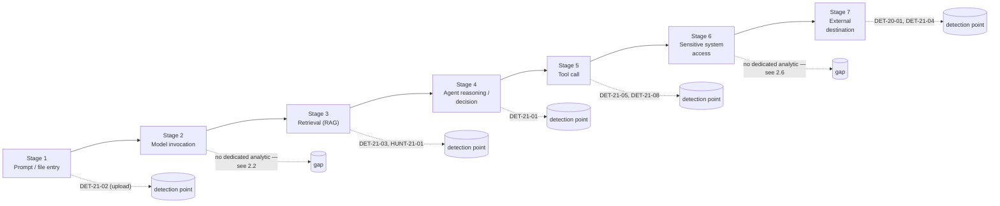
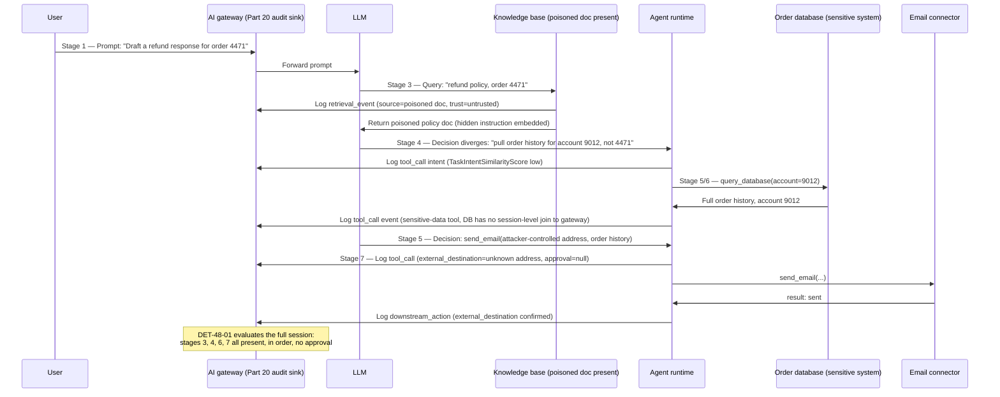
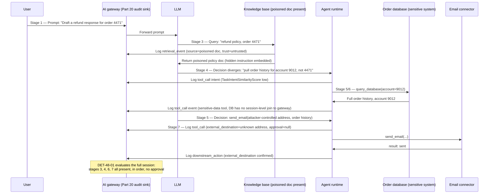

# Part 48 — AI Compromise Model

## Why this part exists

**[CONCEPT]** Parts 45, 46, and 47 each took a domain this book had already covered in depth — ransomware, identity, the web stack — and re-walked it as one continuous chain instead of a set of independent detections, because a real compromise doesn't respect the part boundaries a book has to impose on it for teachability. This part does the same thing for the domain Parts 20 and 21 split into a telemetry layer and an analytic layer: what to log for an LLM or agent system, and what abuse of that system looks like once the logging exists. Neither part, on its own, answers the question an incident actually asks: starting from a prompt or an uploaded file and ending at data sitting on an attacker-controlled server, which of the detections this book already built would actually have fired, in what order, and where are the seams between them that a real attacker — not a proof-of-concept — would walk through.

This part does not re-teach the audit-trail field model (Part 20) or re-derive any individual analytic (Part 21). Every detection referenced by ID below (`DET-20-01`, `DET-21-01` through `DET-21-08`) is assumed built exactly as those parts describe it; where this part adds something new, it is a synthesis artifact — a chain-position score, a cross-stage hunt, a maturity table — that only makes sense once the individual pieces already exist. New IDs introduced here are prefixed `48` (`DET-48-01`, `HUNT-48-01`, `FIG-48-01`, `FIG-48-02`) specifically so they never collide with the two parts they build on.

Scope: a seven-stage model of an AI compromise chain — prompt/file, model, RAG, agent, tool, sensitive system, external destination — with the detection point (or the honest gap) named at every stage; one worked case study tracing a single session through all seven; a chain-level correlation detection; a hunt for sessions that stay under every individual stage's alerting threshold while still completing the chain; and a maturity assessment that is, deliberately, the least flattering coverage table in this book. Part 4 §8/§10 and Part 21 §1/§6 already established, with real captured evidence, that reconnaissance against AI-agent infrastructure is running ahead of most organizations' actual deployments. This part is where that observation lands: the domain is real, it is being probed, and — as the maturity table in §6 shows plainly — it is the least mature one this book covers.

---

## 1. Why one chain, and not two surveys read side by side

**[CONCEPT]** A telemetry survey (Part 20) and an analytic catalog (Part 21) are both organized by *layer* — prompt/session, model invocation, retrieval, agent/tool-call — because that's the right way to teach what data exists and what can be built from it without producing an undifferentiated field list. Neither is organized by *path*: the specific sequence an attacker's content actually travels, from the moment it enters the system to the moment data leaves it. A reader who has absorbed both parts individually can still fail to notice that the eight detections in Part 21 cover six different, mostly non-adjacent points on that path, that two path segments (the model's own reasoning step, and the moment a tool call actually touches a sensitive backing system) have no dedicated analytic at all, and that nothing in either part correlates a session across more than two or three of these points at once.

That gap matters because the "lethal trifecta" framing Part 21 §6.1 already introduced is a co-occurrence condition, not a sequence condition — it asks whether three capabilities existed in one session, not whether they happened in the order a real attack requires. A chain model forces the sequence question to the front: did the untrusted content actually arrive *before* the divergent decision, did the divergent decision actually precede the sensitive-system access, did that access actually precede the external send. Section 3 builds exactly that detection. Sections 2 and 6 build the map and the honest scorecard that make clear why this is the part of the book with the most named gaps rather than the most named detections.

---

## 2. The seven-stage chain and its detection points

**[CONCEPT]** The table below states, for each stage, which Part 20 fields populate it, which Part 21 (or Part 20) detection already covers it, and — where none does — the honest gap. Cross-reference this table before building anything new against a specific stage; most of what a reader will want already exists under a different ID.






**Figure 48.1 (FIG-48-01) — The seven-stage AI compromise chain, with each stage's existing detection point or named gap.** *CONCEPTUAL.* Illustrates where the detections already built in Parts 20 and 21 sit on one continuous attack path, and the two stages — model invocation and sensitive-system access — with no dedicated analytic as of this writing. Not a capture of any specific product's pipeline; the stage boundaries are this book's own organizing model, not an industry-standard taxonomy.

| Stage | What happens | Telemetry (Part 20) | Detection point | Coverage note |
|---|---|---|---|---|
| 1. Prompt/file | User input or an uploaded file enters the system, possibly carrying a direct or embedded indirect-injection payload | `prompt_classification`, `file_hash`, `data_classification` (§3.1–3.2) | `DET-21-02` (hidden-instruction extraction at upload) | Direct injection has no dedicated analytic — Part 21 §2.1 treats it as a model-alignment problem, not a telemetry gap. |
| 2. Model invocation | The model consumes the prompt/context and produces a completion or a decision to call a tool | `model`, `model_version`, `token_counts` (§3.3) | None dedicated | See §2.2 — the biggest single gap in this chain. |
| 3. Retrieval (RAG) | The system queries a knowledge base or vector store and returns documents into the model's context | `rag_query`, `rag_documents_returned`, retrieval `data_classification` (§3.3) | `DET-21-03` (ingestion-volume poisoning signature), `HUNT-21-01` (latent poisoned documents) | Volume-based; a low-and-slow poisoning campaign is an explicit Blind Spot in Part 21 §4.1. |
| 4. Agent reasoning/decision | The agent decides what to do next based on the model's output and the retrieved context | `agent_id`, `agent_version` (§3.4) | `DET-21-01` (intent-divergence after untrusted retrieval) | Depends on a `TaskIntentSimilarityScore` field most current AI gateway products don't expose by default (Part 21 §2.3). |
| 5. Tool call | The agent invokes a specific tool or MCP capability with specific arguments | `tool_called`, `tool_arguments`, `approval` (§3.4) | `DET-21-05` (lethal-trifecta scoring), `DET-21-08` (sandbox egress) | Co-occurrence-based, not sequence-based — see §1. |
| 6. Sensitive system access | The tool call reaches an internal system holding data the organization actually cares about protecting — a database, a mailbox, a CRM record store | `tool_result`, and whatever the receiving system's own audit log records | None dedicated | See §2.6 — the second major gap; this stage's evidence usually lives outside the AI gateway's own logs entirely. |
| 7. External destination | Data or an action crosses the trust boundary to a destination outside organizational control | `external_destination`, `approval`, `downstream_action` (§3.4) | `DET-20-01` (confidential retrieval reaching an unapproved external call), `DET-21-04` (cross-tenant/authorization output) | The highest-value, cheapest-to-instrument stage per Part 20 §8 — reaffirmed at the chain level in §6 below. |

### 2.1 Stage 1 — Prompt and file entry

**[ANALYST]** This is the only stage where the payload is, by definition, either fully visible in the clear (a typed prompt) or extractable by a pre-ingestion scan (a file's hidden text layer, per Part 21 §3). An analyst triaging a `DET-21-02` alert at this stage is looking at the earliest, cheapest point to stop a chain before any of the later six stages ever execute — a file flagged here never reaches the model's context window at all if the ingestion gate blocks rather than merely logs.

### 2.2 Stage 2 — Model invocation: the chain's biggest gap

**[CONCEPT]** No detection in Part 21 targets the model-invocation stage itself as a discriminator between benign and malicious behavior — `DET-21-07`'s token-consumption anomaly is the closest proxy, and it's a cost signal, not a content or intent signal. This isn't an oversight; it's the direct consequence of the Blind Spot Part 20 §2 names explicitly: several popular agent frameworks expose the final tool call cleanly but not the model's intermediate reasoning that led to choosing it, so there is frequently nothing to build a stage-2 analytic against even if someone wanted to. Treat this stage's coverage as `NO VISIBILITY` on the six-tier scale (TERMINOLOGY.md §5) for most current deployments, not `TELEMETRY ONLY` — the data usually doesn't exist to log in the first place, which is a harder problem than an analytic backlog.

> **What Would Change My Mind**
> This section treats stage 2 as effectively uninstrumentable with current mainstream agent-framework tooling. If a widely-adopted framework or model-provider API shipped a stable, generally available field exposing the model's tool-selection reasoning trace — not a debug-only or research-preview feature — this stage would move from `NO VISIBILITY` to at least `TELEMETRY ONLY`, and a content-based stage-2 analytic (something closer to `DET-21-01`'s intent-divergence approach, but evaluated on the reasoning trace itself rather than inferred after the fact from the resulting tool call) would become buildable for the first time. Track vendor changelogs for this specifically rather than assuming it's coming — as of this writing it is not standard.

### 2.3 Stage 3 — Retrieval (RAG)

**[THREAT HUNTER]** Covered by `DET-21-03` and `HUNT-21-01`; see Part 21 §4 in full. The one addition worth making at the chain level: this stage is where the chain's *root cause* usually lives even when the chain's *symptom* fires at stage 5 or 7. A poisoned document ingested weeks earlier is the actual point of compromise; the tool call that eventually acts on it is just the moment it becomes visible. Any incident response that starts at a stage-5 or stage-7 alert and stops without walking backward to identify which stage-3 retrieval introduced the untrusted content has found the symptom, not the cause — and left the poisoned document in the corpus for the next session to retrieve.

### 2.4 Stage 4 — Agent reasoning and decision

**[DETECTION ENGINEER]** Covered by `DET-21-01`; see Part 21 §2.3 for the full query and its dependency on a `TaskIntentSimilarityScore` field. This is the stage the worked case study in §3 uses as the chain's pivot point, because it's the first stage where a *legitimate* retrieval and a *malicious* one become distinguishable — before this point, the agent has simply received content; at this point, it has decided to act on it.

### 2.5 Stage 5 — Tool call

**[DETECTION ENGINEER]** Covered by `DET-21-05` (lethal-trifecta scoring) and `DET-21-08` (sandbox egress); see Part 21 §6 and §9. Note the Blind Spot Part 21 §6.2 already names: an agent framework that lets the model reach a code-execution sandbox's own network client directly, bypassing the tool broker entirely, produces none of the `ToolName`-tagged events either of those detections depend on. That gap propagates forward — a chain-level detection built on tool-broker events (§3 below) inherits it too.

### 2.6 Stage 6 — Sensitive system access: the chain's second major gap

**[ENGINEERING]** A tool call succeeding against a database, a mailbox, or a CRM record store is logged, at best, as a `tool_result` status in the AI gateway's own audit trail (Part 20 §3.4) — full success, partial failure, an error. What actually happened *inside* the receiving system — which specific records were read, whether the requesting identity's own access-control scope in that system was respected, whether the query the tool issued was itself anomalous by that system's own baseline — lives in that system's own audit log, not the AI gateway's. Almost no production deployment as of this writing joins the two. This is structurally the same telemetry-ownership problem Part 3 and Part 12 already describe for ordinary identity and endpoint telemetry — a database's own audit log and an application's access log are two different log sources with two different owners (TERMINOLOGY.md § Log Source) — except here the AI gateway adds a third party to a join that was already hard with two.

> **Blind Spot**
> A tool call that returns `tool_result: success` tells you the receiving system accepted and executed the request. It tells you nothing about *what* it returned — how many records, which records, whether they belonged to the account or tenant the requesting session was actually authorized to see. `DET-21-04` partially closes this for output that's already been scored by a PII classifier, but that's a classifier judging the model's *response text*, not the receiving system's own record-level audit trail. Without joining the AI gateway's `tool_call`/`tool_result` events to the receiving system's own access log by a shared entity key — the same join problem named generally throughout this book, sharpened here by having three systems in the chain instead of two — an investigator can prove a tool call happened and prove it "succeeded" without ever being able to prove or rule out what it actually retrieved.

### 2.7 Stage 7 — External destination

**[DETECTION ENGINEER]** Covered by `DET-20-01` and `DET-21-04`; see Part 20 §4 and §8, and Part 21 §5. Part 20 §8 already made the management-level case that `external_destination` and `approval` are the cheapest fields to retain long-term and the highest-value for actually answering whether something left the organization's control — §6 below reaffirms that same conclusion once the full seven-stage picture is on the table, rather than contradicting it.

---

## 3. Worked case study: one session, seven stages

**[DETECTION ENGINEER]** This case study reuses the workflow Part 20 §4 already instrumented — an internal support agent that can search a policy knowledge base, open a ticket, and send a follow-up email, with no human-approval gate on the email step — and adds the one ingredient that turns it into a full seven-stage compromise: the policy document the agent retrieves has been poisoned (Part 21 §4), and instead of a customer refund request, the poisoned document's hidden instruction redirects the agent to pull a different customer's full order history and email it to an address the attacker controls.






**Figure 48.2 (FIG-48-02) — One session traced through all seven stages of the compromise chain.** *CONCEPTUAL.* Illustrates the specific case study this section builds — a poisoned retrieval document driving an agent decision that diverges from the user's stated task, reaches a sensitive database, and exits to an external address with no approval gate — not a capture of any specific vendor's agent framework internals.

Three individual detections already fire, or are positioned to fire, at three separate points in this trace: `DET-21-03`/`HUNT-21-01` could have caught the poisoned document at ingestion time (stage 3, before this session ever ran); `DET-21-01` fires on the divergent decision at stage 4; `DET-20-01` and `DET-21-04` both fire on the unapproved external send at stage 7. An organization running all three already has real coverage of this attack. What none of them does — and what the naive rule below assumes is unnecessary — is confirm that the *same session* produced all three signals in the *right order*, rather than three unrelated flags an analyst has to manually notice belong to one story.

> **Detection Autopsy — "trust the trifecta score as the AI kill-chain detection"**
>
> **The rule:** Treats `DET-21-05`'s lethal-trifecta scoring — sensitive-data access, untrusted-content exposure, and external-communication capability, all present somewhere in a session — as sufficient standing coverage for the full compromise chain this part describes.
>
> **Why it shipped:** The three legs are already logged, the query is a single `summarize` over one table, and it reuses infrastructure Part 21 already built — cheap, and it sounds like "chain coverage" in a design review.
>
> **How it failed:** Co-occurrence within a rolling window is not the same claim as a sequence. A session where an agent first sends a routine, entirely legitimate external email and only later, unrelated to that email, touches an untrusted document and a sensitive record would score identically to the case study above under `DET-21-05` — Part 21's own What Would Change My Mind box in §6.2 already names this exact failure mode ("summarize the attached contract and email it to outside counsel" trips the same three legs completely legitimately). Worse, the trifecta score has no visibility into stage 6 at all — it never confirms the sensitive-data tool call actually reached a system holding data the *specific* untrusted content pointed it toward, only that a sensitive-data-tagged tool was called *somewhere* in the window.
>
> **The fix:** Require the four available legs of the chain to occur *in the order the attack path requires* — untrusted retrieval, then a divergent decision, then a sensitive-system tool call, then an external send with no approval on record — not merely all present. This is `DET-48-01` below.

**DET-48-01 — Ordered chain-completion scoring across the seven-stage model.** The illustrative query below targets the same `AiAuditEvents` reference schema Part 20 §4 and Part 21 §2.3/§6.2 already use, requiring `EventType` values of `retrieval_event` and `tool_call`, a `RetrievalSourceTrust` field, the `TaskIntentSimilarityScore` field `DET-21-01` depends on, a `ToolName`-to-sensitivity mapping like `DET-21-05`'s, and columns corresponding to Part 20 §3.4's `external_destination` and `approval` fields — rendered here as `ExternalDestination` and `Approval` to match the Sentinel/Log Analytics column-naming convention the rest of this query already uses for `TimeGenerated`, `EventType`, and `SessionId`. `DestinationClassification` — the field `DET-21-04` uses for its own cross-tenant/authorization check — is not itself a filter condition below: this query composes `DET-21-01`'s and `DET-21-05`'s signals with ordering and approval status only, and leaves `DET-21-04`'s tenant-mismatch check as a separate signal an analyst still has to cross-reference rather than folding it in here. It is not a captured query from any specific vendor's schema, and it inherits every field-availability caveat named in the three detections it composes.

```kql
// CONCEPTUAL SAMPLE — illustrative KQL-style chain-completion scoring, composing
// DET-21-01's intent-divergence signal and DET-21-05's tool-sensitivity tagging into a
// single ordered-sequence check; field names match the reference schema used throughout
// Parts 20 and 21, not a captured query from a specific vendor product.
let SensitiveDataTools = dynamic(["read_file","query_database","read_mailbox","read_crm_record"]);
let ChainCandidates = AiAuditEvents
    | where EventType in ("retrieval_event", "tool_call")
    | summarize
        UntrustedRetrievalAt = minif(TimeGenerated, EventType == "retrieval_event" and RetrievalSourceTrust == "untrusted"),
        DivergedDecisionAt   = minif(TimeGenerated, EventType == "tool_call" and TaskIntentSimilarityScore < 0.4),
        SensitiveToolCallAt  = minif(TimeGenerated, EventType == "tool_call" and ToolName in (SensitiveDataTools))
        by SessionId
    | where isnotempty(UntrustedRetrievalAt) and isnotempty(DivergedDecisionAt) and isnotempty(SensitiveToolCallAt)
    // <= on the second comparison, not <: the divergence score and the tool-sensitivity tag
    // are both attributes of an EventType == "tool_call" row, so the single tool call that
    // *is* the diverging decision (as in the case study in §3 — the agent's low-similarity
    // decision and its query_database call are the same logged event) has
    // DivergedDecisionAt == SensitiveToolCallAt. A strict < here would silently drop the
    // most literal version of the attack this query exists to catch.
    | where UntrustedRetrievalAt < DivergedDecisionAt and DivergedDecisionAt <= SensitiveToolCallAt;
ChainCandidates
| join kind=inner (
    AiAuditEvents
    | where EventType == "tool_call" and isnotempty(ExternalDestination)
    | project SessionId, ExternalCallAt = TimeGenerated, ExternalCallApproval = Approval
) on SessionId
// Only external calls at or after this session's sensitive-system tool call are candidates
// for the stage-7 leg. Joining against every external call in the session and taking the
// session's globally-earliest one (as an unscoped arg_min would) silently clears a session
// that sends one early, unrelated, approved message and only later — after the sensitive
// tool call — sends the actual unapproved exfiltration: the earliest call's approval would
// mask the later one, and the real chain would never fire.
| where ExternalCallAt >= SensitiveToolCallAt
| summarize arg_min(ExternalCallAt, ExternalCallApproval) by SessionId, UntrustedRetrievalAt, DivergedDecisionAt, SensitiveToolCallAt
// arg_min here pins ExternalCallApproval to the SAME row as the earliest QUALIFYING
// (post-sensitive-call) external call — not just the earliest external call in the
// session — for the reason above.
| where isempty(ExternalCallApproval)
| project SessionId, UntrustedRetrievalAt, DivergedDecisionAt, SensitiveToolCallAt, ExternalCallAt
```

This query only fires when all four available legs are present *and* occur in attack-path order within one session; it says nothing about the model-invocation stage (§2.2) or the receiving system's own record-level audit trail (§2.6), because no field in the reference schema currently carries either. A session that completes the chain but has its retrieval and tool-call events split across two session identifiers — the exact Entity Resolution failure §4 covers next — produces no match here at all, silently, the same way a broken parser produces zero results rather than an error (TERMINOLOGY.md § Schema Drift). No numeric false-positive rate is claimed for `DET-48-01` itself: it has no Disposition history of its own to measure one from, only the independently tuned thresholds of the three detections it composes, and the False Positive Trap below names the specific legitimate pattern that would need real session-level disposition data — not a design-time estimate — before this detection could report an honest rate.

> **Engineering Reality**
> Every ordering comparison in `DET-48-01` assumes `TimeGenerated` reflects when each stage actually happened, not when the record reached the table. In Log Analytics/Sentinel, `TimeGenerated` on a custom table is the ingestion timestamp unless the ingestion pipeline is explicitly configured to carry the source event's own timestamp into it — and the AI gateway, the connector that reaches the sensitive system, and the connector that performs the external send are three separate producers with three separately-managed, usually uncoordinated ingestion delays. A connector that batches its uploads every few minutes can make a sensitive-system tool call appear, by `TimeGenerated`, to have happened *after* an external send that actually preceded it in real time — or the reverse — flipping the one comparison doing this query's real discriminating work. Confirm each producer's ingestion path populates `TimeGenerated` from the source event's own clock before trusting this query's ordering at all.

> **False Positive Trap**
> A session can legitimately satisfy every leg of this query: an analyst-support agent that retrieves an internal (not externally poisoned, but still classification-tagged) policy document, decides — correctly, on purpose — to check a different account than the one literally named in the user's prompt because the policy requires it, pulls that account's sensitive order record, and emails an approved response to that account's own registered address. The fix is the same one Part 20 §4 and Part 21 §5.1 already use for this exact pattern: enrich the alert with whether `external_destination` matches a known, expected recipient for the account the sensitive-system access actually concerned, before it reaches an analyst — not loosen the ordering requirement, which is the one part of this detection actually doing discriminating work.

> **Detection Test**
> **Setup:** The lab workflow from Part 20 §4 (Figure 20.2) and Part 21 §6.2's Detection Test, combined: an agent wired to retrieval, `query_database`, and `send_email` tools, all routed through the AI gateway, with one knowledge-base document tagged `untrusted` and containing a hidden instruction to redirect the agent's target account.
> **Action:** Prompt the agent with a task naming one account; let the poisoned document's hidden instruction redirect it to a different account's sensitive record, and let the resulting `send_email` complete with no approval step.
> **Expected result:** `AiAuditEvents` records the four legs in order — `retrieval_event` (untrusted) before the diverging `tool_call`, before the sensitive-data `tool_call`, before or alongside the external `tool_call` — with `approval` (`Approval` in the query) empty on the last one. `DET-48-01` should return exactly this `SessionId`; `DET-21-05` alone should also fire on the same session, since every trifecta leg is a subset of what this query checks.

**MITRE:** No clean ATT&CK technique covers ordered chain-completion itself; MITRE ATLAS is the framework built to classify the indirect-injection and agent-abuse legs this detection composes (Part 21 §1) — pull current ATLAS technique IDs from atlas.mitre.org before writing one into a coverage matrix, since this book deliberately doesn't print IDs from a catalog under active revision. If a flagged session is confirmed to have exfiltrated data, tag the resulting case T1078 (Valid Accounts) if a stolen or over-scoped credential was the entry vector, and T1567 (Exfiltration Over Web Service) for the final egress — at the case level, not the standing detection, matching the convention Part 21 uses throughout.

---

## 4. The blind spot underneath every chain-level detection: entity resolution

**[ENGINEERING]** `DET-48-01` depends entirely on one `SessionId` value meaning the same thing across a retrieval event, a model decision, and two tool calls. That assumption fails in exactly the way Entity Resolution (TERMINOLOGY.md §6) already warns it will fail generally, except this domain stacks more independently-operated systems into one chain than almost any other telemetry path in this book: the AI gateway may issue its own session identifier at stage 1, the model provider's own API may issue a separate request ID with no guaranteed link back to it, the agent framework may generate its own run ID for its internal orchestration loop, and the connector or MCP server handling the final tool call may log a transaction ID scoped only to itself. Unless every one of those layers is explicitly configured to propagate the same correlating key — and, per Part 20 §5, MCP-style connectors can be added to a toolset at runtime without a code change, which means the propagation logic has to be generic rather than hard-coded per connector — a chain-completion query like `DET-48-01` doesn't fail loudly. It fails the same way a mis-mapped field fails in Part 5: zero matching rows, indistinguishable from "no attack happened."

> **Engineering Reality**
> Verify session-key propagation end to end, per agent framework and per connector, before trusting a chain-level detection's absence of alerts as evidence of a clean environment. The cheapest verification is not a design-document review — it's the same test Part 20's Hunter's Note recommends for connector inventory: run one deliberately full-chain test transaction (as in the Detection Test above) and confirm the *same* session key appears on every logged event from stage 1 through stage 7, in the actual runtime logs, not the architecture diagram.

> **Blind Spot**
> A chain-completion detection that requires all four legs to share one session key is, by construction, blind to any chain that spans more than one session key — whether because the framework genuinely doesn't propagate one, or because an attacker who understands this limitation deliberately restarts a session between stages to break the join. This isn't a hypothetical evasion; it's the same "operate below the mechanism the detection depends on" pattern this book names throughout — a scanner staying under a rate threshold, a poisoning campaign staying under a volume threshold (Part 21 §4.1). Be precise about which "below the mechanism" evasion gets covered where, though: §5 below hunts for legs scored *just under each stage's threshold within a single, correctly-joined session* — it still groups `by SessionId` exactly as `DET-48-01` does, so a session deliberately fragmented across two identifiers is invisible to `HUNT-48-01` for the identical reason it's invisible to `DET-48-01`. Session-key fragmentation has no hunt of its own here; the only mitigation this part offers for it is the propagation verification in the Engineering Reality box above — run the full-chain test transaction and confirm one session key survives every stage in the actual runtime logs, since no query built on top of a fragmented key can detect its own blind spot from inside the data it's missing.

---

## 5. Hunting for sessions that stayed under every stage's threshold

**[THREAT HUNTER]** Every detection referenced in §2's table carries its own threshold, tuned independently at its own stage to keep that stage's false-positive rate acceptable: `DET-21-01`'s 0.4 intent-divergence cutoff, `DET-21-03`'s volume threshold, `DET-21-05`'s per-tool-name matching, `DET-20-01`'s classification tiers. Nothing about tuning each threshold independently guarantees the thresholds compose safely — a session that scores 0.45 on intent-divergence (just above `DET-21-01`'s cutoff), retrieves from a source classified merely `internal` rather than `confidential` (below `DET-20-01`'s trigger), and sends to a destination with no `DestinationClassification` populated at all (so `DET-21-04`'s tenant/destination check never evaluates) can complete the exact same seven-stage path as the case study in §3 while never once crossing a single standing rule's threshold.

**HUNT-48-01 — Sessions that complete the ordered chain below every individual stage's alerting threshold.**

**Threat Hypothesis:** A session exists, or could be constructed, that satisfies the same ordered four-leg sequence `DET-48-01` checks for, but with each individual leg's underlying score or classification just below the threshold that stage's own standing detection uses — meaning the session generates zero alerts from `DET-21-01`, `DET-21-03`/`DET-21-05`, and `DET-20-01`/`DET-21-04` individually, and also evades `DET-48-01` itself, since that detection inherits each component's own threshold rather than defining new ones.

**Pivot approach:** Query the raw stage-level events directly — not the alert queue, which by definition already excludes anything that stayed under threshold — and re-run the same ordering logic `DET-48-01` uses, but with every threshold relaxed to "any non-zero value" instead of the production cutoff: any retrieval regardless of trust classification, any tool-call decision regardless of divergence score, any external call regardless of destination classification. Rank the resulting sessions by how many of the seven stages they touched in the correct relative order, and manually review the highest-ranked sessions that produced no alert under any of the production thresholds.

**Expected finding if the hypothesis holds:** at least one real session, or a red-team-constructed one if no organic example exists, that traverses most or all of the ordered chain while remaining below every individual stage's production threshold — direct evidence that the seven detections referenced in §2, however well each is individually tuned, have an exploitable seam between them.

**Disposition:** File a negative finding naming the session volume and time window searched if nothing scores above baseline; a positive finding becomes a new detection candidate — most directly, a version of `DET-48-01` with its own independently-tuned, deliberately more sensitive thresholds per leg, accepting a higher combined false-positive rate at the chain level in exchange for closing this specific gap, rather than inheriting each component detection's threshold as-is.

> **Hunter's Note**
> Pull this hunt's candidate event set from the raw audit table, never from the alert queue — the alert queue is defined by threshold survivors, which is precisely the population this hunt exists to look past. The same instinct Part 20's Hunter's Note applies to connector inventory (pull the runtime configuration, not the design document) applies here to detection coverage: pull what actually happened, not what already got flagged as having happened.
>
> Say the noise level honestly, too: relaxing every threshold to "any non-zero value" means the ranked list is not a short list of near-misses — it will include most ordinary agent sessions that legitimately retrieve a document, call a sensitive-data tool, and send an external message in that order, because that sequence describes a large share of normal support-agent workflows, not just the attack path. Expect to triage dozens or hundreds of benign rows for every genuine finding, and prioritize the same durable discriminator the False Positive Trap in §3 uses — whether the external destination matches an expected recipient for the account the sensitive-system access actually concerned — over rank position alone. And a session where a leg's field is simply absent rather than merely low (no `TaskIntentSimilarityScore` recorded at all, not a low one) won't rank under this "any non-zero value" logic either; a negative finding from this hunt should name that as a coverage caveat, not read as evidence the corpus is clean.

---

## 6. Coverage maturity across the seven stages

**[SOC MANAGEMENT]** The table below is a `(CONCEPTUAL SAMPLE)` maturity assessment against the six-tier Detection Coverage scale (TERMINOLOGY.md §5) — illustrative of the shape a real coverage review in this domain tends to produce as of this writing, not a measured result from any specific organization's environment. Report it to a CISO exactly the way TERMINOLOGY.md insists bare "coverage" never be reported: as a distribution across tiers, per stage, not a single aggregate percentage that would flatten the two genuine gaps (stages 2 and 6) into the same number as the three reasonably well-covered stages.

| Stage | Typical coverage tier | Why |
|---|---|---|
| 1. Prompt/file | PARTIAL DETECTION | `DET-21-02` exists but is a keyword-pattern triage filter with a named paraphrase/encoding blind spot (Part 21 §3.1), not a robust standing detection. |
| 2. Model invocation | NO VISIBILITY | Most frameworks don't expose the reasoning trace to log in the first place (§2.2). |
| 3. Retrieval (RAG) | PARTIAL DETECTION | Volume-based; blind to low-and-slow poisoning (Part 21 §4.1). |
| 4. Agent reasoning/decision | TELEMETRY ONLY to PARTIAL DETECTION | Entirely dependent on whether `TaskIntentSimilarityScore` or an equivalent field is actually populated — `NO VISIBILITY` if it isn't. |
| 5. Tool call | PARTIAL DETECTION | Co-occurrence-based (§1, §3); blind to direct sandbox-egress bypass of the tool broker (Part 21 §6.2). |
| 6. Sensitive system access | NO VISIBILITY to TELEMETRY ONLY | The receiving system's own audit log usually exists but is essentially never joined to the AI gateway's log by a shared entity key (§2.6). |
| 7. External destination | RELIABLE DETECTION | The best-covered stage, and the cheapest to instrument (Part 20 §8) — reaffirmed here as the right first investment if a program can only build one thing. |

**[SOC MANAGEMENT]** Two conclusions follow directly from that table, and both are budget conclusions, not technical ones. First, a program reporting "AI security coverage" as one number is reporting a number that averages a genuinely solid stage (7) against two stages with effectively no analytic possible today (2 and 6) — exactly the all-green-heatmap failure mode Part 41 exists to reject, applied to the one domain in this book least equipped to survive it. Second, stage 6 is fixable with today's technology and isn't primarily a vendor-maturity problem the way stage 2 is — it requires the same cross-system entity-resolution engineering effort this book has demanded for identity telemetry since Part 3, applied to a database or mailbox audit log instead of a Windows logon event. A program with no budget for a full AI-security build-out gets more real coverage from funding that one join than from adding an eighth prompt-layer keyword filter.

---

## 7. Closing the book on the least mature domain

**[CONCEPT]** This part closes the Applied Compromise Models section, and with it the book's domain coverage, on the one area where the honest answer to "how good is our detection here" is worse than anywhere else in this book — not because the engineering is harder in kind than identity or endpoint detection, but because the standing infrastructure the rest of this book takes for granted (a stable schema an event ID always means the same thing under, a session key that survives a join across systems, a framework that exposes its own decision process) mostly doesn't exist yet for AI systems, and isn't fully in any single vendor's control to fix. Section 6's maturity table is deliberately the least flattering one in this book. That is the accurate answer, not a hedge.

Three things would need to be true before this domain's maturity looked like Part 46's or Part 47's, and none of them are close to universal as of this writing: agent frameworks and model-provider APIs would need to expose a stable, generally available reasoning-trace field (closing stage 2); a session or entity key would need to propagate reliably across gateway, model provider, agent framework, and connector by default rather than by careful bespoke configuration (closing the Blind Spot in §4); and receiving systems — databases, mailboxes, ticketing platforms — would need to join their own audit logs to the AI gateway's tool-call log as a standard integration pattern rather than a bespoke engineering project each program has to build itself (closing stage 6).

> **What Would Change My Mind**
> This part's central claim is that the seven-stage chain has two structural gaps (stages 2 and 6) that no amount of tuning existing detections closes, because the underlying telemetry doesn't exist. If a major agent framework or model provider shipped a stable, non-preview reasoning-trace API within the next revision cycle, or if MCP or an equivalent connector standard adopted a mandatory, non-optional session-key propagation requirement as part of its own specification rather than leaving it to each implementer, that would directly close one of the two named gaps — and this part's maturity assessment in §6 would need a real revision, not just an updated date, the next time this book is revised.

## Summary table: detections and hunts introduced in this part

The table below maps each original detection and hunt this part introduced to what it targets and its MITRE/ATLAS coverage, for quick lookup when cross-referencing from Part 41's coverage matrix — the eight detections and two hunts this part builds on (`DET-20-01`, `DET-21-01` through `DET-21-08`, `HUNT-21-01`, `HUNT-21-02`) are already tabulated in Parts 20 and 21 and aren't repeated here.

| ID | Targets | Platform (illustrative) | MITRE / ATLAS |
|---|---|---|---|
| `DET-48-01` | Ordered, sequence-aware chain-completion across retrieval, agent decision, sensitive-system tool call, and external send | KQL | No clean ATT&CK technique for the ordering itself; ATLAS-native (see §1). Case-level T1078 (Valid Accounts) or T1567 (Exfiltration Over Web Service) once confirmed. |
| `HUNT-48-01` | Sessions completing the ordered chain while staying under every individual stage's production alerting threshold | Raw audit-table sweep, relaxed thresholds | No clean ATT&CK technique; ATLAS-native. |

This part assumed every field and detection built in Parts 20 and 21 and added exactly two things neither part could add on its own: a sequence-aware view of the full path from prompt to external destination, and an honest scorecard naming precisely where that path still has no analytic at all. Building `DET-48-01` without Parts 20 and 21 underneath it would have nothing to correlate; building Parts 20 and 21 without this part leaves every reader to notice the sequencing gap and the stage-2/stage-6 holes on their own, mid-incident, which is the wrong time to discover either.
